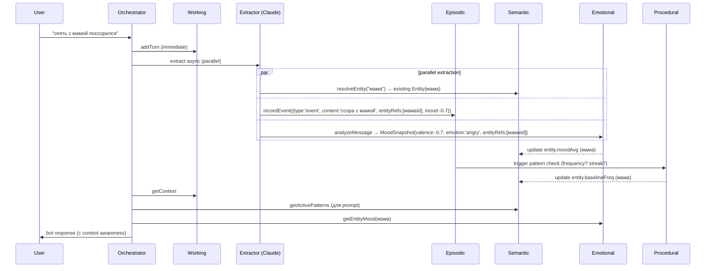
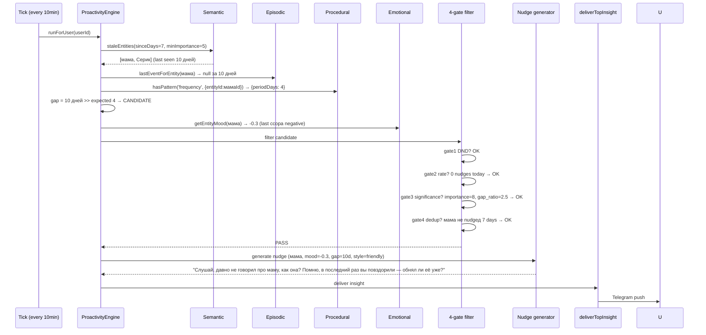
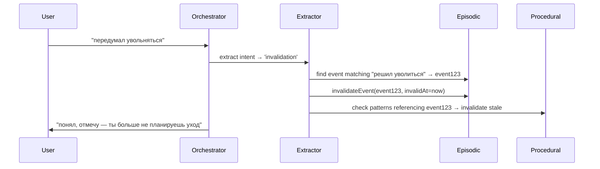

# v2.0 Memory + Proactivity — Design Spec

**Created:** 2026-05-28
**Author:** AI agent (под supervision Berik)
**Status:** DRAFT — awaiting Berik review
**Scope lock:** `docs/plan/v2-memory-proactivity-scope.md`
**Path:** 2 (5-tier phased, 9-10 недель total)

---

## 0. Reading order

Если первый раз — читай по порядку. Если корректируешь — секции
самостоятельны, можно по одной.

1. Контекст и цели (зачем это)
2. Архитектурный overview (5-tier map)
3-7. Каждый tier подробно (schema + API + flows)
8. Consolidation flows (как tier'ы триггерят друг друга)
9. Proactivity engine (heartbeat + 4-gate filter + nudges)
10. Agent tool extensions (новые tools для бота)
11. Migration plan (наши 67 rows → новые tables)
12. Test strategy
13. Rollout (feature flag stages)
14. Failure modes + edge cases (что может пойти не так)
15. Self-review checklist (mental tests)
16. Open questions для Berik

---

## 1. Контекст и цели

### 1.1 Что строим

**Joi-like AI друг.** Бот который:
- Помнит детали разговоров (мама = Гульнара, Алматы, др 15 марта)
- Замечает изменения («ты давно не упоминал X», «ты сегодня грустно»)
- Инициирует разговор сам («как там встреча с Сериком?»)
- Знает паттерны юзера («обычно бросаешь habits на 3-й неделе»)
- Имеет имя + характер (не безличный helper)
- Не спамит — 1-2 проактивных reach-outs / день максимум

### 1.2 Что НЕ строим (Phase A)

- ❌ Hermes-level skill auto-creation (phase B)
- ❌ NEST-level emergent personality (axis signals — phase B)
- ❌ Identity evolution (имя растёт, persona меняется — phase B)
- ❌ Cross-session learning loop с self-improvement (phase B)
- ❌ Neo4j (Postgres CTE достаточно в Phase A)
- ❌ Mem0/Zep/Letta как библиотеки (паттерны — да, lib — нет)

### 1.3 Benchmark Phase A done

```
Сценарий 1 — Gap detection:
  Юзер: «вчера был у мамы»
  → memory: создаётся event «встреча с мамой» 2026-05-27
  → entity «мама» lastSeenAt обновляется
  ...10 дней молчания...
  → proactivity tick: «мама» lastSeen = 10 дней назад
  → bot: «давно ничего не говорил про маму, как она?»

Сценарий 2 — Pattern awareness:
  Юзер 3 недели подряд бросает habit «бег»
  → pattern detector извлекает «бег: drop at week 3»
  → следующий раз когда юзер создаёт привычку:
    bot: «слушай, ты обычно бросаешь привычки на 3-й неделе.
           давай я напомню тебе в это время?»

Сценарий 3 — Mood awareness:
  Юзер: «опять накосячил на работе»
  → mood: negative
  → entity «работа» mood снизился
  → bot: подстраивает тон (мягче, supportive, не давит на задачи)
  → если pattern: «стресс на работе → 3 дня апатии»
    bot: «давай сегодня без больших задач, отдохни»
```

### 1.4 Цели проектирования

- **Reversibility:** каждый шаг feature-flagged, мгновенный rollback
- **Composability:** tier'ы изолированы, каждый можно testить отдельно
- **Performance:** retrieval p95 < 500ms для 1000 entities
- **Cost:** +1 LLM call на extraction, batch'ить где можно
- **Honesty:** никаких fake summary, бот не врёт о действиях

---

## 2. Архитектурный overview

```
┌──────────────────────────────────────────────────────────────────┐
│                    REQUEST FLOW                                    │
├──────────────────────────────────────────────────────────────────┤
│                                                                    │
│   Telegram msg                                                     │
│       ↓                                                            │
│   jarvis-orchestrator.handleMessage                                │
│       ↓                                                            │
│   ┌──────────────────────────────────────────────────────────┐    │
│   │  PARALLEL EXTRACTION (background, не блокирует ответ)     │    │
│   │    - entityExtractor → Entity/EntityRelationship          │    │
│   │    - eventExtractor → MemoryEvent (validAt now)           │    │
│   │    - moodClassifier → MoodSnapshot (per-msg)              │    │
│   │    - patternDetector → batch weekly + on-demand           │    │
│   └──────────────────────────────────────────────────────────┘    │
│       ↓                                                            │
│   ┌──────────────────────────────────────────────────────────┐    │
│   │  MAIN RESPONSE GENERATION (synchronous)                    │    │
│   │    Context Builder:                                        │    │
│   │      - Working memory (last N msgs)                        │    │
│   │      - Recent entities mentioned (semantic)                │    │
│   │      - Active patterns (procedural)                        │    │
│   │      - Current mood + entity moods (emotional)             │    │
│   │      - Identity (имя бота + стиль)                         │    │
│   │    → jarvis-prompt.system enriched                         │    │
│   │    → runAgent (Claude Sonnet 4.6 + tools)                  │    │
│   │    → Reply                                                 │    │
│   └──────────────────────────────────────────────────────────┘    │
│                                                                    │
└──────────────────────────────────────────────────────────────────┘

┌──────────────────────────────────────────────────────────────────┐
│                    PROACTIVE FLOW (background)                     │
├──────────────────────────────────────────────────────────────────┤
│                                                                    │
│   proactive-scheduler tick (every 10 min, уже есть)                │
│       ↓                                                            │
│   v2-proactivity-engine.runForUser(userId)                         │
│       ↓                                                            │
│   ┌──────────────────────────────────────────────────────────┐    │
│   │  CHANGE DETECTOR                                          │    │
│   │    - Entities с lastSeen > expected gap                   │    │
│   │    - Patterns triggered (e.g. «week 3 of habit»)          │    │
│   │    - Mood shifts (sustained negative > N days)            │    │
│   │    - Goals без progress > week                            │    │
│   └──────────────────────────────────────────────────────────┘    │
│       ↓                                                            │
│   ┌──────────────────────────────────────────────────────────┐    │
│   │  4-GATE FILTER (KAIROS pattern from NEST)                 │    │
│   │    Gate 1: DND quiet hours (uses existing infra)          │    │
│   │    Gate 2: Rate limit (max 1-2 nudges/день/юзер)          │    │
│   │    Gate 3: Significance score > threshold                 │    │
│   │    Gate 4: Dedup (тот же entity не повторяем 7 дней)      │    │
│   └──────────────────────────────────────────────────────────┘    │
│       ↓                                                            │
│   ┌──────────────────────────────────────────────────────────┐    │
│   │  NUDGE GENERATOR                                          │    │
│   │    - Tone from UserProfile.styleNotes                     │    │
│   │    - Template lookup OR Claude generation                 │    │
│   │    - Output: insight row                                  │    │
│   └──────────────────────────────────────────────────────────┘    │
│       ↓                                                            │
│   deliverTopInsight (existing) → Telegram push                     │
│                                                                    │
└──────────────────────────────────────────────────────────────────┘
```

---

## 3. Tier 1 — Working Memory

### 3.1 Назначение

Краткосрочный контекст текущего разговора. Last N msgs + fresh entities
+ active mood. Используется в каждом response для continuity.

### 3.2 Storage

**Не новая таблица.** Используем существующие:
- `ChatMessage` (persisted) — last 200 msgs in DB
- In-process `Map<userId, WorkingContext>` — hot cache last hour

### 3.3 Schema (TypeScript, не Prisma — in-memory)

```typescript
type WorkingContext = {
  userId: string;
  lastMessages: Array<{ role: 'user' | 'assistant'; content: string; ts: Date }>;
  freshEntities: Set<string>;  // entity ids mentioned last hour
  currentMood: number;          // -1..+1, decay over time
  lastActivityAt: Date;
};
```

### 3.4 API

```typescript
// packages/server/src/services/working-memory.ts
export class WorkingMemory {
  // O(1) — add new turn to working context
  addTurn(userId: string, msg: ChatMessage): void;

  // O(1) — current snapshot for prompt enrichment
  getContext(userId: string): WorkingContext | null;

  // Eviction policy: idle > 1 hour → drop from cache, persist to ChatMessage
  evictIdle(): void;
}
```

### 3.5 Consolidation triggers

- Каждый turn → addTurn в Map
- Idle > 1 hour → entries from Map консолидируются в Episodic memory
  (extract events) + dropped from Map
- ChatMessage уже persists per-msg (не теряем данные)

### 3.6 Edge cases

| Case | Behavior |
|---|---|
| Cache miss (server restart) | Lazy-load from ChatMessage last 50 msgs |
| Map grows unbounded (memory leak) | Eviction every 5 min, max 1000 active users |
| Race condition (parallel turns) | Sequential processing per userId (Promise queue) |

---

## 4. Tier 2 — Episodic Memory

### 4.1 Назначение

События во времени: «звонил маме», «купил кроссовки», «поссорился с
Сериком». Каждый event имеет `validAt` (когда случилось) и опционально
`invalidAt` (когда стал недействителен — e.g. «решил уволиться»
становится invalid когда «передумал»).

### 4.2 Storage — расширяем существующую Memory table

```prisma
// packages/server/prisma/schema.prisma — ИЗМЕНЕНИЕ
model Memory {
  // существующие поля (НЕ удаляем)
  id          String    @id @default(cuid())
  userId      String
  user        User      @relation(fields: [userId], references: [id])
  // FULL enum (no '...'): 'fact' | 'event' | 'decision' | 'preference' | 'person' | 'place' | 'emotion'
  type        String
  content     String
  details     String?
  source      String
  sourceId    String?
  tags        String[]
  importance  Int       @default(5)
  expiresAt   DateTime?
  embedding   Unsupported("vector(512)")?
  createdAt   DateTime  @default(now())

  // НОВЫЕ поля (v2.0)
  validAt     DateTime  @default(now())  // когда event случился
  invalidAt   DateTime?                  // когда event стал недействителен (null = действующий)
  entityRefs  String[]  @default([])     // FK на Entity.id (массив, multi-entity events)
  mood        Float?                     // -1..+1, эмо-tone события

  @@index([userId, validAt])
  @@index([userId, invalidAt])
  @@index([userId, entityRefs], type: Gin)  // array search
}
```

**Migration:** все существующие 67 rows получают `validAt = createdAt`,
`invalidAt = null`, `entityRefs = []`, `mood = null`. Non-breaking.

### 4.3 API

```typescript
// packages/server/src/services/episodic-memory.ts
export interface EpisodicMemory {
  // Создать event
  recordEvent(userId: string, event: {
    type: string;
    content: string;
    details?: string;
    entityRefs?: string[];
    mood?: number;
    validAt?: Date;
    importance?: number;
  }): Promise<{ id: string }>;

  // Invalidate event (e.g. «передумал увольняться»)
  invalidateEvent(eventId: string, invalidAt?: Date): Promise<void>;

  // Retrieval — события связанные с entity, опционально в диапазоне
  getEventsForEntity(userId: string, entityId: string, opts?: {
    validBetween?: [Date, Date];
    includeInvalid?: boolean;
    limit?: number;
  }): Promise<MemoryEvent[]>;

  // Temporal query: last event involving entity
  lastEventForEntity(userId: string, entityId: string): Promise<MemoryEvent | null>;

  // Frequency: how often entity mentioned per period
  entityFrequency(userId: string, entityId: string, periodDays: number): Promise<number>;
}
```

### 4.4 Consolidation triggers

- Из jarvis-orchestrator после каждого msg → eventExtractor (Claude
  extract в фоне) → если есть actionable event → recordEvent
- Если juzer явно говорит «забудь» / «передумал» → invalidateEvent

### 4.5 Edge cases

| Case | Behavior |
|---|---|
| validAt > invalidAt (logic error) | Validation в API: throw before write |
| Event без entityRefs | OK (свободные events) |
| Mood out of range [-1, +1] | Clamp в API |
| Conflict: «звонил маме» 2 раза одной датой | OK (frequency считает count) |
| Migration: legacy Memory без validAt | Default = createdAt в migration script |

---

## 5. Tier 3 — Semantic + Entity Graph

### 5.1 Назначение

Знание о юзере: кто такие люди в его жизни, что любит, что важно. Граф
связей: «мама ↔ день рождения 15 марта», «мама ↔ Серик (брат)»,
«работа ↔ стресс ↔ паттерн апатии».

### 5.2 Storage — новые таблицы

```prisma
// НОВАЯ таблица
model Entity {
  id          String   @id @default(cuid())
  userId      String
  user        User     @relation(fields: [userId], references: [id], onDelete: Cascade)
  // 'person' | 'place' | 'concept' | 'goal' | 'organization'
  type        String
  // Каноническое имя (после normalization): "мама", "Серик Иванов"
  name        String
  // Aliases для FTS: ["мам", "мама", "мам.", "mom"]
  aliases     String[] @default([])
  // Свободные attrs: { birthDay: "15 марта", city: "Алматы" }
  attributes  Json     @default("{}")
  // last_seen в conversation (любой mention)
  lastSeenAt  DateTime @default(now())
  // Frequency baseline: avg mentions per week
  baselineFreq Float   @default(0)
  // Mood association (running avg of related events mood)
  moodAvg     Float?
  // 1-10, важность (manual или auto-inferred)
  importance  Int      @default(5)
  // Embedding для semantic search
  embedding   Unsupported("vector(512)")?

  createdAt   DateTime @default(now())
  updatedAt   DateTime @updatedAt

  relsFrom    EntityRelationship[] @relation("FromEntity")
  relsTo      EntityRelationship[] @relation("ToEntity")

  @@unique([userId, type, name])
  @@index([userId, type])
  @@index([userId, lastSeenAt])
  @@index([userId, importance])
}

// НОВАЯ таблица
model EntityRelationship {
  id          String   @id @default(cuid())
  userId      String
  user        User     @relation(fields: [userId], references: [id], onDelete: Cascade)
  fromId      String
  from        Entity   @relation("FromEntity", fields: [fromId], references: [id], onDelete: Cascade)
  toId        String
  to          Entity   @relation("ToEntity", fields: [toId], references: [id], onDelete: Cascade)
  // FULL enum (no '...'): 'family' | 'friend' | 'colleague' | 'partner' |
  //   'concern' | 'goal_link' | 'location' | 'works_at' | 'lives_in' |
  //   'connected_to' (fallback generic)
  type        String
  // Свободное описание: "брат", "коллега по проекту"
  label       String?
  // 0..1, strength of relationship (auto или manual)
  strength    Float    @default(0.5)
  // Temporal (Graphiti pattern)
  validAt     DateTime @default(now())
  invalidAt   DateTime?

  createdAt   DateTime @default(now())

  @@unique([userId, fromId, toId, type, validAt])
  @@index([userId, fromId])
  @@index([userId, toId])
}
```

### 5.3 API + abstraction layer

```typescript
// packages/server/src/services/entity-graph/types.ts
export interface EntityGraphStore {
  // Resolve canonical entity from raw mention
  // "мам", "маме", "мама" → один Entity{type:'person', name:'мама'}
  resolveEntity(userId: string, mention: string, type?: string):
    Promise<Entity | null>;

  // Create or upsert
  upsertEntity(userId: string, entity: Partial<Entity> & { name: string; type: string }):
    Promise<Entity>;

  // Get by id
  getEntity(id: string): Promise<Entity | null>;

  // Relationship CRUD
  linkEntities(userId: string, fromId: string, toId: string,
    type: string, opts?: { label?: string; strength?: number }):
    Promise<EntityRelationship>;

  // Graph queries
  getNeighbors(entityId: string, depth: number):
    Promise<Array<{ entity: Entity; relation: EntityRelationship; distance: number }>>;

  // Temporal query — entities not mentioned for N days
  staleEntities(userId: string, sinceDays: number, minImportance?: number):
    Promise<Entity[]>;
}

// packages/server/src/services/entity-graph/postgres-impl.ts
// Default implementation для Phase A — recursive CTE
export class PostgresEntityGraph implements EntityGraphStore { ... }

// packages/server/src/services/entity-graph/neo4j-impl.ts
// Future swap для Phase B+ если масштаб потребует
// export class Neo4jEntityGraph implements EntityGraphStore { ... }
```

### 5.4 Recursive CTE для getNeighbors (Postgres example)

```sql
-- Все entities в N-hop радиусе от given entity
WITH RECURSIVE neighbors AS (
  -- base case: direct neighbors (distance 1)
  SELECT r."toId" AS entityId, r.type, r.label, 1 AS distance
  FROM "EntityRelationship" r
  WHERE r."fromId" = $1 AND r."invalidAt" IS NULL
  UNION
  SELECT r."fromId", r.type, r.label, 1
  FROM "EntityRelationship" r
  WHERE r."toId" = $1 AND r."invalidAt" IS NULL

  UNION

  -- recursive case: friends of friends
  SELECT r."toId", r.type, r.label, n.distance + 1
  FROM neighbors n
  JOIN "EntityRelationship" r ON r."fromId" = n.entityId
  WHERE n.distance < $2 AND r."invalidAt" IS NULL
)
SELECT DISTINCT e.*, n.distance, n.type AS relType, n.label
FROM neighbors n
JOIN "Entity" e ON e.id = n.entityId
ORDER BY n.distance, e.importance DESC;
```

### 5.5 Consolidation triggers

- Из msg → entityExtractor (Claude extract) → upsertEntity (с
  deduplication через resolveEntity)
- При создании event с entityRefs → проверить что entities существуют
- При confirmation отношения («Серик мой брат») → linkEntities

### 5.6 Edge cases

| Case | Behavior |
|---|---|
| Два разных «Серик» (брат + коллега) | Resolved по контексту через embedding similarity или ask user |
| Entity rename («мама теперь бабушка» — promotion) | Old entity invalidated (через `aliases` add), new entity created, link migrated |
| Circular relationships (A→B→A) | Allowed (это часто реальная семантика) |
| Recursive CTE depth limit | Hard cap в API (max depth=5), prevent runaway |
| Missing FK (deleted entity, dangling event) | Soft-delete pattern: entity не удаляем, помечаем `invalidAt` |

---

## 6. Tier 4 — Procedural Mini

### 6.1 Назначение

Извлечённые паттерны поведения юзера:
- Частота: «упоминает маму каждые 3-5 дней»
- Время суток: «обычно тренируется в 7 утра»
- Recurring topics: «когда стресс → ест больше»
- Обязательства: «обещал начать читать в понедельник» (с tracking)

**Mini-version в Phase A:** статистические extracted patterns, без
ML/skill creation. Phase B добавит Hermes-like skill auto-generation.

### 6.2 Storage

```prisma
// НОВАЯ таблица
model Pattern {
  id          String   @id @default(cuid())
  userId      String
  user        User     @relation(fields: [userId], references: [id], onDelete: Cascade)
  // 'frequency' | 'time_of_day' | 'recurring_topic' | 'commitment' | 'streak_break'
  kind        String
  // Human-readable description: "упоминает маму каждые 3-5 дней"
  description String
  // Structured data зависит от kind:
  //   frequency: { entityId, periodDays, lastObservedAt }
  //   time_of_day: { activity, hourMode, dayOfWeek? }
  //   recurring_topic: { topic, triggerPattern, freq }
  //   commitment: { what, dueAt, fulfilled }
  //   streak_break: { habitId, weekNumber, observedAt }
  payload     Json
  // 0..1 confidence (based on # observations)
  confidence  Float    @default(0)
  // # of supporting observations
  observations Int     @default(1)
  // last time pattern был triggered/validated
  lastObservedAt DateTime @default(now())
  // pattern может стать stale если не повторяется
  // например юзер изменил режим → старый pattern not valid
  validAt     DateTime @default(now())
  invalidAt   DateTime?
  createdAt   DateTime @default(now())
  updatedAt   DateTime @updatedAt

  @@index([userId, kind])
  @@index([userId, confidence])
  @@index([userId, validAt, invalidAt])
}
```

### 6.3 API

```typescript
// packages/server/src/services/procedural-memory.ts
export interface ProceduralMemory {
  // Batch extraction: scan recent events + patterns, extract new
  // Run weekly (cron) + on-demand (после major event)
  extractPatterns(userId: string): Promise<Pattern[]>;

  // Get active patterns for context enrichment
  getActivePatterns(userId: string, opts?: {
    kinds?: string[];
    minConfidence?: number;
  }): Promise<Pattern[]>;

  // Check specific pattern: "user has streak_break at week N pattern?"
  hasPattern(userId: string, kind: string, payload: object): Promise<Pattern | null>;

  // Invalidate stale pattern (no observations in M periods)
  invalidateStale(userId: string): Promise<number>;
}
```

### 6.4 Pattern extractors (mini, Phase A)

#### Frequency extractor
```typescript
// Для каждой entity с importance >= 5:
// 1. Get events за last 60 дней involving this entity
// 2. Compute median interval между mentions
// 3. Если median consistent (stddev < 50% median) → pattern «частота X дней»
//    confidence = min(1, observations / 10)
```

#### Time-of-day extractor
```typescript
// Для каждого habit с >= 14 logs:
// 1. Get hour-of-day distribution of completedAt
// 2. Если 70%+ logs в окне ±2 часа → pattern «обычно в HH:00»
//    confidence = 70%+ / max_window_pct
```

#### Recurring topic extractor
```typescript
// Для каждой entity с importance >= 7 и frequency > 1/week:
// 1. Group events by topic (через embedding cluster)
// 2. Если cluster повторяется >= 3 раза → pattern «recurring topic X»
```

#### Commitment extractor
```typescript
// Scan recent msgs (last 7 дней) для phrases:
// "обещаю", "буду", "начну с", "решил", "с понедельника"
// → create Pattern{ kind: 'commitment', payload: { what, dueAt } }
// При наступлении dueAt → check fulfilled (по events)
// Pattern updated с fulfilled=true/false → для бота «ты обещал X, как?»
```

#### Streak-break extractor
```typescript
// Для habits с history >= 6 недель:
// 1. Find weeks где habit completion rate < 30% после streak
// 2. Если break на одной и той же неделе ≥ 2 times → pattern
//    «бросает habit на N-й неделе»
```

### 6.5 Consolidation triggers

- Weekly cron (sunday evening) → extractPatterns(userId) batch
- On-demand: после создания habit → check streak-break pattern
- On-demand: после commitment phrase в msg → extractor immediately

### 6.6 Edge cases

| Case | Behavior |
|---|---|
| Patterns в conflict (frequency сказал X, наблюдаем Y) | Invalidate old, create new (higher confidence wins) |
| Low confidence patterns | Excluded from proactivity (threshold 0.6) |
| User explicitly says «больше не делаю X» | Manually invalidate matching patterns |
| Pattern grows stale (no observations 30 дней) | invalidateStale marks invalidAt |

---

## 7. Tier 5 — Emotional + Identity Mini

### 7.1 Назначение

**Emotional layer:**
- Mood per msg (sentiment + emotional content)
- Entity mood association («работа» — chronically stressful, «походы» — happy)
- Mood timeline (для бота: «ты последние 3 дня грустнее обычного»)

**Identity mini:**
- Имя бота (юзер выбирает при онбординге: «Эля», «Ария», etc. — default
  random feminine name)
- Выбранный стиль (existing 4: friendly/strict/calm/toxic)
- Phase A — статичный, Phase B — emergent personality

### 7.2 Storage

```prisma
// НОВАЯ таблица — mood snapshots
model MoodSnapshot {
  id          String   @id @default(cuid())
  userId      String
  user        User     @relation(fields: [userId], references: [id], onDelete: Cascade)
  // Source: per-msg analysis OR aggregated daily
  source      String   // 'message' | 'daily_agg'
  sourceId    String?  // ChatMessage.id если from msg
  // -1..+1 valence (negative — positive)
  valence     Float
  // 0..1 arousal (calm — excited)
  arousal     Float    @default(0.5)
  // Named emotion: 'sad' | 'anxious' | 'happy' | 'angry' | 'neutral' | 'mixed'
  emotion     String
  // Free entity associations (этот mood relates to these entities)
  entityRefs  String[] @default([])
  // Original message snippet (для аудита)
  excerpt     String?
  recordedAt  DateTime @default(now())

  @@index([userId, recordedAt])
  @@index([userId, emotion])
  @@index([userId, entityRefs], type: Gin)
}

// НОВАЯ таблица — identity (1:1 с User)
model BotIdentity {
  id          String   @id @default(cuid())
  userId      String   @unique
  user        User     @relation(fields: [userId], references: [id], onDelete: Cascade)
  // Имя бота, выбранное юзером
  botName     String   @default("Эля")
  // Avatar emoji или image url (Phase A — emoji)
  avatar      String   @default("🤍")
  // Selected style (synced с User.assistantStyle для compat)
  style       String   @default("friendly")
  // Phase B будет storing accumulated traits (axis signals)
  // в Phase A — placeholder JSON
  traits      Json     @default("{}")
  createdAt   DateTime @default(now())
  updatedAt   DateTime @updatedAt
}
```

### 7.3 API

```typescript
// packages/server/src/services/emotional-memory.ts
export interface EmotionalMemory {
  // Per-message analysis (existing emotional-classifier extended)
  analyzeMessage(userId: string, msgId: string, content: string):
    Promise<MoodSnapshot>;

  // Aggregate mood for time window
  getMoodTimeline(userId: string, sinceDays: number):
    Promise<Array<{ date: string; valence: number; emotion: string }>>;

  // Entity-specific mood (avg of related moods)
  getEntityMood(userId: string, entityId: string): Promise<number>;

  // Detect mood shift (e.g. «3 days more negative than baseline»)
  detectMoodShift(userId: string): Promise<{
    shifted: boolean;
    direction?: 'up' | 'down';
    magnitude?: number;
    sinceDays?: number;
  } | null>;
}

// packages/server/src/services/bot-identity.ts
export interface IdentityService {
  // Get/create (default Эля если first time)
  getIdentity(userId: string): Promise<BotIdentity>;

  // User changes name/avatar/style
  updateIdentity(userId: string, updates: Partial<BotIdentity>): Promise<BotIdentity>;
}
```

### 7.4 Consolidation triggers

- Каждый incoming msg → analyzeMessage (extends existing
  emotional-classifier) → MoodSnapshot created
- Если valence != null AND msg mentions entities → entityRefs populated
- Nightly cron → aggregate per-day mood → MoodSnapshot{source:'daily_agg'}
- При onboarding → ask имя бота → IdentityService.updateIdentity

### 7.5 Edge cases

| Case | Behavior |
|---|---|
| Mood ambivalent ("и хорошо и плохо") | emotion='mixed', valence=avg |
| Entity moods conflict (job: sometimes +, sometimes -) | Running avg, не overwrite |
| User меняет style mid-session | Existing convo continues old, new convo new |
| Bot name conflicts с user message ("Эля...") | Bot уважает имя, но contextually distinguishes |
| MoodSnapshot table grows huge | Retention: aggregate >30 days into daily_agg, drop per-message |

---

## 8. Consolidation Flows (как tier'ы триггерят друг друга)

### 8.1 Inbound: user msg → all tiers update



### 8.2 Outbound: proactive tick → nudge



### 8.3 Invalidation flow (event becomes invalid)



---

## 9. Proactivity Engine

### 9.1 Scheduler hookup

Existing `proactive-scheduler.ts` тик каждые 10 min. Добавляем:

```typescript
// packages/server/src/services/proactive-scheduler.ts (edit)
async function tickForUser(userId: string): Promise<void> {
  // ... existing logic (morning brief, evening summary, etc.)

  // v2.0 — proactivity engine
  if (process.env.FEATURE_V2_PROACTIVITY === 'true') {
    try {
      await v2ProactivityEngine.runForUser(userId);
    } catch (err) {
      console.warn(`[v2-proactivity] failed user=${userId}:`, err);
    }
  }
}
```

### 9.2 Engine API

```typescript
// packages/server/src/services/v2-proactivity-engine.ts
export interface ProactivityEngine {
  // Main entry от scheduler tick
  runForUser(userId: string): Promise<{
    candidatesFound: number;
    candidatesAfterFilter: number;
    nudgesDelivered: number;
  }>;

  // Detection: scan all sources, return candidates
  detectCandidates(userId: string): Promise<NudgeCandidate[]>;

  // Filter: apply 4 gates
  filterCandidates(userId: string, candidates: NudgeCandidate[]):
    Promise<NudgeCandidate[]>;

  // Generate: pick top candidate, generate nudge text
  generateNudge(userId: string, candidate: NudgeCandidate): Promise<string>;
}

export type NudgeCandidate = {
  source: 'stale_entity' | 'commitment_due' | 'mood_shift' | 'streak_break' | 'goal_no_progress';
  significance: number;  // 0..1
  entityId?: string;
  patternId?: string;
  // Free metadata
  payload: Record<string, unknown>;
  // Suggested tone hint
  toneHint: 'gentle' | 'curious' | 'supportive' | 'celebratory';
};
```

### 9.3 4-gate filter implementation

```typescript
// gate1: DND quiet hours (uses existing dnd-service)
async function gate1_DND(userId: string): Promise<boolean> {
  const inDND = await isInDNDWindow(userId, new Date());
  return !inDND;
}

// gate2: rate limit (max 2 nudges per day per user)
async function gate2_RateLimit(userId: string): Promise<boolean> {
  const todayCount = await prisma.insight.count({
    where: {
      userId,
      source: 'v2-proactivity',
      createdAt: { gte: startOfTodayLocal(userId) },
    },
  });
  return todayCount < 2;
}

// gate3: significance threshold
function gate3_Significance(candidate: NudgeCandidate): boolean {
  return candidate.significance >= 0.6;
}

// gate4: dedup (no nudge for same entity in last 7 days)
async function gate4_Dedup(userId: string, candidate: NudgeCandidate): Promise<boolean> {
  if (!candidate.entityId) return true;
  const recent = await prisma.insight.findFirst({
    where: {
      userId,
      source: 'v2-proactivity',
      metadata: { path: ['entityId'], equals: candidate.entityId },
      createdAt: { gte: subDays(new Date(), 7) },
    },
  });
  return recent === null;
}
```

### 9.4 Significance scoring

```typescript
// scoring function — выше score = больше шансов на nudge
function scoreSignificance(c: NudgeCandidate): number {
  switch (c.source) {
    case 'stale_entity': {
      // gap_ratio = actual_gap / expected_period (из pattern)
      // importance вес от Entity.importance
      const gapRatio = c.payload.gapRatio as number;
      const importance = (c.payload.importance as number) ?? 5;
      return Math.min(1, (gapRatio / 5) * (importance / 10));
    }
    case 'commitment_due': {
      const daysOverdue = c.payload.daysOverdue as number;
      return Math.min(1, 0.5 + daysOverdue / 7);
    }
    case 'mood_shift': {
      const magnitude = Math.abs(c.payload.magnitude as number);
      return Math.min(1, magnitude);
    }
    case 'streak_break': {
      const consistency = c.payload.consistency as number;  // 0..1 of pattern
      return consistency * 0.8;
    }
    case 'goal_no_progress': {
      const daysSilent = c.payload.daysSilent as number;
      return Math.min(1, daysSilent / 14);
    }
  }
}
```

### 9.6 Cron tasks (NEW — добавлено в self-review)

```typescript
// packages/server/src/services/cron/mood-retention.ts (NEW)
// Weekly: drop per-message MoodSnapshots older than 30 days,
// aggregate into daily snapshots
export async function moodRetentionCron(): Promise<void> {
  const cutoff = subDays(new Date(), 30);
  // 1. Aggregate per user per day
  await prisma.$executeRaw`
    INSERT INTO "MoodSnapshot" (id, "userId", source, valence, arousal, emotion, "recordedAt")
    SELECT gen_random_uuid()::text, "userId", 'daily_agg',
           AVG(valence), AVG(arousal),
           MODE() WITHIN GROUP (ORDER BY emotion),
           date_trunc('day', "recordedAt")
    FROM "MoodSnapshot"
    WHERE source = 'message' AND "recordedAt" < ${cutoff}
    GROUP BY "userId", date_trunc('day', "recordedAt")
    ON CONFLICT DO NOTHING
  `;
  // 2. Drop per-message
  await prisma.moodSnapshot.deleteMany({
    where: { source: 'message', recordedAt: { lt: cutoff } },
  });
}

// packages/server/src/services/cron/pattern-extraction.ts (NEW)
// Weekly (sunday evening): extract patterns for all active users
export async function patternExtractionCron(): Promise<void> {
  const activeUsers = await prisma.user.findMany({
    where: { /* активен last 7 дней */ },
    select: { id: true },
  });
  for (const u of activeUsers) {
    await procedural.extractPatterns(u.id);
  }
}
```

Wired в proactive-scheduler.ts: запускается в воскресенье вечер
(одноразово, не каждый tick).

### 9.5 Nudge generation

Template-based с Claude fallback:

```typescript
async function generateNudge(userId: string, c: NudgeCandidate): Promise<string> {
  const profile = await getUserProfile(userId);
  const identity = await getIdentity(userId);
  const styleNotes = profile.styleNotes ?? 'тёплый дружеский тон';

  // Template lookup first (fast, deterministic)
  const template = TEMPLATES[c.source]?.[c.toneHint];
  if (template) {
    return interpolate(template, c.payload);
  }

  // Fallback: Claude generation (slower, used rare cases)
  return await runAgent({
    system: `Ты — ${identity.botName}, ${styleNotes}. Сгенерируй ОДНО короткое
            (1-2 предложения) проактивное сообщение пользователю на основе
            наблюдения: ${JSON.stringify(c)}. Tone: ${c.toneHint}.`,
    userMessage: 'Generate.',
    maxTokens: 200,
    webSearch: false,
    localTools: false,
  });
}
```

---

## 10. Agent Tool Extensions

Бот сам должен мочь обновлять память — нужны новые tools в registry.

### 10.1 Telegram commands (НОВЫЕ — добавлены в self-review)

```typescript
// packages/server/src/services/telegram-bot.ts (edit)
// /setname <Имя> — пользователь меняет имя бота
bot.command('setname', async (ctx) => {
  const newName = ctx.message.text.split(' ').slice(1).join(' ').trim();
  if (!newName) return ctx.reply('Использование: /setname Имя');
  if (newName.length > 30) return ctx.reply('Имя слишком длинное (макс 30)');
  await identityService.updateIdentity(userId, { botName: newName });
  ctx.reply(`Готово, теперь меня зовут ${newName} 🤍`);
});
```

### 10.2 Agent tools (registry extension)

```typescript
// packages/server/src/tools/remember-entity.ts (NEW)
export const rememberEntityTool = defineTool({
  name: 'remember_entity',
  description: 'Запомнить нового человека/место/концепцию в жизни юзера.',
  category: 'memory',
  schema: z.object({
    type: z.enum(['person', 'place', 'concept', 'goal', 'organization']),
    name: z.string().max(120),
    attributes: z.record(z.unknown()).optional(),
    importance: z.number().min(1).max(10).optional(),
  }),
  needsConfirm: false,
  sideEffects: 'write',
  handler: async (input, ctx) => {
    const entity = await entityGraph.upsertEntity(ctx.userId, input);
    return { message: `Запомнил: ${entity.name}`, entityId: entity.id };
  },
});

// packages/server/src/tools/link-relationship.ts (NEW)
export const linkRelationshipTool = defineTool({
  name: 'link_relationship',
  description: 'Связать два запомненных entities (мама ↔ Серик = семья).',
  category: 'memory',
  schema: z.object({
    fromName: z.string(),
    toName: z.string(),
    type: z.string().max(40),
    label: z.string().max(120).optional(),
  }),
  // ... handler
});

// packages/server/src/tools/suggest-goal.ts (NEW)
export const suggestGoalTool = defineTool({
  name: 'suggest_goal',
  description: 'Предложить пользователю записать цель (он подтверждает).',
  category: 'goal',
  schema: z.object({
    area: z.enum(['finance', 'career', 'health', 'spirituality']),
    goalText: z.string().max(300),
    rationale: z.string().max(500).describe('почему бот считает это стоит цели'),
  }),
  needsConfirm: true,  // critical — юзер confirm
  sideEffects: 'write',
  // ... handler — создаёт YearlyGoal только после confirm
});
```

Аналогично: `suggest_task`, `suggest_event`, `suggest_habit`.

---

## 11. Migration Plan

### 11.1 Текущее состояние

- 67 Memory rows в проде (Berik + Aydana + 10 тестовых юзеров)
- 0 UserProfile rows для большинства (1 для Berik после v1.4.0 fix)
- 0 Pattern/Entity/EntityRelationship/MoodSnapshot/BotIdentity (новые)

### 11.2 Migration script

```typescript
// packages/server/scripts/migrate-to-v2.ts
async function migrate(userId: string) {
  // 1. Extract entities из existing Memory rows
  const memories = await prisma.memory.findMany({ where: { userId } });
  for (const m of memories) {
    if (m.type === 'person') {
      await entityGraph.upsertEntity(userId, {
        type: 'person',
        name: m.content,  // simple — может быть messy, нормализуем
        importance: m.importance,
      });
    }
    // Аналогично для place, decision (как goal), event (не entity)
  }

  // 2. Backfill validAt = createdAt для всех Memory (default migration)
  await prisma.$executeRaw`UPDATE "Memory" SET "validAt" = "createdAt" WHERE "validAt" IS NULL`;

  // 3. Create BotIdentity с default
  await prisma.botIdentity.upsert({
    where: { userId },
    create: { userId, botName: 'Эля', style: user.assistantStyle ?? 'friendly' },
    update: {},
  });

  // 4. Run pattern extractor once
  await procedural.extractPatterns(userId);
}
```

### 11.3 Schema migration (Prisma)

```sql
-- packages/server/prisma/migrations/20260601000000_v2_memory_layer/migration.sql

-- 1. Memory table extensions
ALTER TABLE "Memory" ADD COLUMN "validAt" TIMESTAMP(3) NOT NULL DEFAULT CURRENT_TIMESTAMP;
ALTER TABLE "Memory" ADD COLUMN "invalidAt" TIMESTAMP(3);
ALTER TABLE "Memory" ADD COLUMN "entityRefs" TEXT[] DEFAULT '{}';
ALTER TABLE "Memory" ADD COLUMN "mood" DOUBLE PRECISION;
UPDATE "Memory" SET "validAt" = "createdAt" WHERE "validAt" IS NULL;
CREATE INDEX "Memory_userId_validAt_idx" ON "Memory"("userId", "validAt");
CREATE INDEX "Memory_userId_invalidAt_idx" ON "Memory"("userId", "invalidAt");
CREATE INDEX "Memory_userId_entityRefs_idx" ON "Memory" USING GIN ("entityRefs");

-- 2. Entity table
CREATE TABLE "Entity" (
    "id" TEXT NOT NULL,
    "userId" TEXT NOT NULL,
    "type" TEXT NOT NULL,
    "name" TEXT NOT NULL,
    "aliases" TEXT[] DEFAULT '{}',
    "attributes" JSONB NOT NULL DEFAULT '{}',
    "lastSeenAt" TIMESTAMP(3) NOT NULL DEFAULT CURRENT_TIMESTAMP,
    "baselineFreq" DOUBLE PRECISION NOT NULL DEFAULT 0,
    "moodAvg" DOUBLE PRECISION,
    "importance" INTEGER NOT NULL DEFAULT 5,
    "embedding" vector(512),
    "createdAt" TIMESTAMP(3) NOT NULL DEFAULT CURRENT_TIMESTAMP,
    "updatedAt" TIMESTAMP(3) NOT NULL,

    CONSTRAINT "Entity_pkey" PRIMARY KEY ("id")
);

ALTER TABLE "Entity" ADD CONSTRAINT "Entity_userId_fkey" FOREIGN KEY ("userId")
    REFERENCES "User"("id") ON DELETE CASCADE ON UPDATE CASCADE;

CREATE UNIQUE INDEX "Entity_userId_type_name_key" ON "Entity"("userId", "type", "name");
CREATE INDEX "Entity_userId_type_idx" ON "Entity"("userId", "type");
CREATE INDEX "Entity_userId_lastSeenAt_idx" ON "Entity"("userId", "lastSeenAt");
CREATE INDEX "Entity_userId_importance_idx" ON "Entity"("userId", "importance");

-- 3. EntityRelationship (similar)
-- 4. Pattern (similar)
-- 5. MoodSnapshot (similar)
-- 6. BotIdentity (similar with @unique userId)
```

### 11.4 Backward compatibility

- **Existing captureMemory / recallMemories продолжают работать** —
  читают/пишут в Memory с новыми полями default-заполненными
- Old code путь не сломан
- v2.0 services пишут параллельно в новые таблицы + старую Memory

### 11.5 Decommission старого (Phase B end)

После того как v2.0 работает 2-4 недели без проблем:
- Удалить captureMemory/recallMemories (всё через new services)
- Memory table остаётся как Tier 2 episodic store (renamed conceptually)
- Old `Memory.type='preference'` мигрировано в UserProfile (уже)

---

## 12. Test Strategy

### 12.1 Unit tests (per tier)

```
packages/server/src/services/__tests__/
├── working-memory.test.ts        (cache eviction, race condition)
├── episodic-memory.test.ts       (validAt/invalidAt logic, frequency calc)
├── entity-graph.test.ts          (resolveEntity dedup, recursive CTE, depth limit)
├── procedural-memory.test.ts     (each extractor: frequency/time/topic/commit/streak)
├── emotional-memory.test.ts      (mood timeline aggregation, entity mood)
├── bot-identity.test.ts          (default Эля, update flow)
├── v2-proactivity-engine.test.ts (4-gate filter, significance scoring)
└── nudge-generator.test.ts       (template interpolation, Claude fallback)
```

Target: 90%+ coverage на pure logic, 70%+ на DB-touching (mock prisma).

### 12.2 Integration tests

```
packages/server/src/__integration__/
├── v2-consolidation-flow.test.ts
│   (msg → all tiers update → context built → response generated)
├── v2-proactivity-flow.test.ts
│   (tick → detect → filter → generate → deliver)
├── v2-invalidation-flow.test.ts
│   ("передумал" → event invalidated → patterns updated)
└── v2-migration.test.ts
    (load 67 Memory rows → migrate → verify integrity)
```

### 12.3 Behavioral SMOKE (Berik + Aydana через бот)

Сценарии в `docs/SMOKE.md`:
1. «Помни мою маму Гульнара, она живёт в Алматы» → Entity created, attributes set
2. (через 10 дней) «как у меня вообще дела?» → бот сам добавляет «давно не говорил про маму»
3. «опять с мамой поссорился» → mood -0.7, entity moodAvg shifts
4. (через 3 дня) → бот: «как с мамой? обнял её?»
5. Создать habit «читать каждый день» → 3 недели логировать → дропнуть → создать снова → бот: «обычно бросаешь на 3-й неделе, давай я напомню?»

### 12.4 Performance tests

```
packages/server/scripts/v2-perf-bench.ts
- Load 1000 Entity rows
- Run 100 proactivity ticks
- Measure: detect p95, filter p95, generate p95
- Target: full tick < 2s for 1000 entities/юзер
```

---

## 13. Rollout Strategy (Feature Flag)

### 13.1 Stages

```
Week 5 day 1: ENV `FEATURE_V2_MEMORY=user-{berikId}`
  → ТОЛЬКО Berik видит новую систему
  → Aydana и все остальные — старый captureMemory

Week 5 day 4-7: Berik smoke-test 4 дня, отчёт
  → Если всё ОК → next stage
  → Если регрессия → ENV отключён, debug

Week 6 day 1: ENV `FEATURE_V2_MEMORY=user-{berikId},user-{aydanaId}`
  → Aydana подключена

Week 7+: gradual rollout всем (если есть other users)
  → ENV `FEATURE_V2_MEMORY=all`

Week 9+: decommission captureMemory/recallMemories (Phase B end)
```

### 13.2 Flag implementation

```typescript
// packages/server/src/lib/feature-flags.ts (NEW)
export function isV2MemoryEnabled(userId: string): boolean {
  const flag = process.env.FEATURE_V2_MEMORY ?? '';
  if (flag === 'all') return true;
  if (flag === '' || flag === 'none' || flag === 'false') return false;
  // Per-user: comma-separated list "user-{id1},user-{id2}"
  return flag.split(',').some(s => s.trim() === `user-${userId}`);
}
```

### 13.3 Rollback

ENV-flag flip → restart Railway (auto). Старая система работает
параллельно — она НЕ удалена, никакой data loss.

---

## 14. Failure Modes + Edge Cases

| # | Mode | Detection | Mitigation |
|---|---|---|---|
| 1 | Entity extraction race (2 параллельных msg создают тот же entity) | Postgres unique constraint violation | Retry с resolveEntity, take winning |
| 2 | validAt > invalidAt в Event | Zod validation в API | throw before write |
| 3 | Recursive CTE runaway (циклы в graph > 5 hops) | Hard depth=5 в API | Max depth cap |
| 4 | Voyage embedding API down при upsertEntity | try/catch, embedding=null | Fallback FTS only, retry потом |
| 5 | Claude extractor timeout (15s) | timeout в anthropic SDK | Skip extraction this msg, retry on next |
| 6 | Pattern extractor crashes (bad SQL on edge data) | Wrapped try/catch | Log, skip pattern, continue |
| 7 | Proactivity tick кричит (LLM down) | runAgent catch | Skip this tick, retry на следующем |
| 8 | 4-gate ложно блокирует все nudges (юзер ничего не получает) | Monitor: zero nudges 7 days | Alert, manual review |
| 9 | False positive nudge ("давно не упоминал X" когда X вчера упомянут) | Manual report from Berik | Tune significance scoring, audit gates |
| 10 | Migration partial fail (некоторые users не мигрированы) | Migration script idempotent + log | Re-run, check audit log |
| 11 | Feature flag flip ломает existing prod юзеров | Old code path не удалён | Flip flag back, debug new path |
| 12 | Mood snapshot table grows unbounded | Cron retention: drop per-msg snapshots > 30 days | Aggregate в daily before drop |
| 13 | Bot спамит несмотря на 4-gate (баг в counter) | Monitor: alert if >3 nudges/day | Hard cap в deliverTopInsight |
| 14 | Pattern становится stale но не invalidated | invalidateStale в weekly cron | Manual UI чтобы юзер мог исправить |
| 15 | Two разных Серика (брат + коллега) → entity collision | resolveEntity по embedding+context | Если ambiguous → ask user OR create separate с suffix |
| 16 | Concurrent writes от parallel msg-extractors → race на upsertEntity | Postgres unique constraint + ON CONFLICT DO NOTHING + return existing | Application-level: serialize per userId через in-process Map<userId, Promise> queue |
| 17 | Double-write конфликт: feature flag ON для юзера → новый код пишет в Entity, а старый captureMemory всё ещё пишет в Memory | Behind flag — старый код **читает только**, не пишет (или пишет в shadow mode только для validation) | Phase A keep dual-write parallel; Phase B end — remove old write |
| 18 | MoodSnapshot table растёт unbounded (1 row per msg × 100 msg/day = 36K/year) | Retention cron — daily aggregation drop per-msg > 30 days | NEW cron task: `mood-retention-cron` weekly, see §9.6 |
| 19 | Entity resolution через embedding ≫ Voyage cost (1 call per mention) | Tiered: FTS exact match first, embedding only if FTS miss | resolveEntity: try exact name + aliases first, fallback to embedding semantic |
| 20 | Identity нет UI для изменения имени бота (Telegram command нужна) | Phase A — default "Эля", change через `/setname Soya` command | Add Telegram command handler, see §10.1 |

---

## 15. Self-Review Checklist

> Это mental tests — agent должен прогнать перед тем как считать spec готовым.

### Placeholder scan
- [ ] Нет «TBD», «TODO», «FIXME» в production-relevant секциях
- [ ] Все API signatures complete (нет `...` в типах)
- [ ] Все Prisma schemas valid (поля, индексы, FK)

### Internal consistency
- [ ] Каждая mentioned таблица определена в Prisma section
- [ ] Каждое API method покрывается consolidation flow
- [ ] Sequence diagrams согласованы с API names

### Ambiguity check
- [ ] «Pattern confidence threshold» — указан конкретно (0.6)
- [ ] «Significance score» — указана scoring function
- [ ] «Rate limit» — конкретные числа (1-2 nudges/день)
- [ ] «Stale entity» — точное определение (lastSeen vs baselineFreq ratio)

### Scope check
- [ ] Tier 4 — действительно MINI (frequency/time/topic/commitment/streak,
      не Hermes skill creation)
- [ ] Tier 5 — действительно MINI (mood timeline + identity static,
      не NEST axis signals)
- [ ] Identity Phase A — статичный (имя + style), не emergent
- [ ] Neo4j НЕ упомянут как requirement в Phase A
- [ ] Mem0/Zep как lib НЕ упомянуты как requirement

### Edge cases coverage
- [ ] Каждая Prisma table имеет migration plan (backfill defaults)
- [ ] Каждый extractor имеет error handling
- [ ] Feature flag rollback path задокументирован
- [ ] Existing captureMemory backward-compatible

### Test coverage
- [ ] Each tier имеет unit test plan
- [ ] Integration tests cover consolidation flows
- [ ] Behavioral SMOKE scenarios конкретные

---

## 16. Open Questions для Berik

Перед implementation хочу подтвердить:

### Q1: Имя бота — default или ask onboarding?
- Option A: Default «Эля» сразу, юзер может изменить
- Option B: Onboarding flow «Как меня назовём?» при первом запуске v2.0
- Recommendation: **A** (меньше friction, юзер change потом)

### Q2: Migration — automatic on deploy или manual script?
- Option A: Automatic — все юзеры мигрированы при deploy
- Option B: Manual — `npx tsx scripts/migrate-to-v2.ts --user=<id>`
- Recommendation: **B** (контроль, можно по одному, безопаснее)

### Q3: Cron частота — каждые 10 min OK или больше/меньше?
- Текущий: 10 min (existing proactive-scheduler)
- Phase A добавляет +1 task per tick — нагрузка на Claude API
- Recommendation: **оставить 10 min**, monitor cost

### Q4: «Эля» — нормальное default имя или другое предложить?
- Other options: Ария, Лина, Соня, Дина, Алия (твоё имя? — нет, конфликт)
- Recommendation: **«Эля»** — короткое, тёплое, не popular так что не конфликтует
- Или **«Лайфа»** — связь с LifeOS
- Final: твой выбор

### Q5: Telegram TTL/conversation reset?
- Если юзер не пишет 7+ дней — working memory dropped (eviction)
- При возврате — что бот скажет? «Привет! Давно не виделись» через
  proactivity engine?
- Recommendation: **да, отдельный «return after absence» trigger** в
  proactivity engine — но **Phase B**, не A

### Q6: Cost monitoring?
- v2.0 добавляет ~3-5 LLM calls per msg (extractors)
- Estimated +$30-50/мес for active users
- OK или нужен ENV-flag для дешёвых users `FEATURE_V2_EXTRACTORS_MIN`?
- Recommendation: **OK, без дополнительных flags в Phase A**, monitor в проде

---

## Spec Status

- ✅ Architectural overview (5-tier)
- ✅ Per-tier design (schema + API + flows)
- ✅ Consolidation flows (sequence diagrams)
- ✅ Proactivity engine (4-gate filter, scoring)
- ✅ Agent tool extensions
- ✅ Migration plan
- ✅ Test strategy
- ✅ Rollout (feature flag stages)
- ✅ Failure modes (15 cases)
- ✅ Self-review checklist
- ⏳ Berik review (THIS PHASE)

After Berik approval → invoke `writing-plans` skill → implementation plan
→ week-by-week tasks → code begins (week 2).

---

## Discipline reminder

> Pacta sunt servanda. Если в process implementation появится «давай ещё
> это» → СТОП → спросить Berik → дождаться approval → обновить scope
> lock + этот spec → продолжить.
>
> Прецедент 2026-05-28 L99 (молчаливое расширение scope) — урок усвоен.

## Honest timeline disclaimer (после self-review)

Scope lock говорит «Phase A — 5 недель». Self-review показал что
**реалистично 6-7 недель** для этого scope:

- 5 новых таблиц (Entity, EntityRelationship, Pattern, MoodSnapshot, BotIdentity)
- 5 новых сервисов (entity-graph, episodic, procedural, emotional, identity)
- Proactivity engine (detect + 4-gate + generate)
- Agent tool extensions (3 new tools)
- Telegram command extension
- 2 new cron tasks (mood-retention, pattern-extraction)
- Migration script для 67 existing rows
- Integration tests + behavioral SMOKE
- Feature flag rollout stages

**5 недель optimistic** (если всё идёт идеально, нет неожиданных bugs).
**6-7 недель realistic.**

В scope lock оставляю 5 нед как **target**, но если хитнусь — СТОП →
доложу Berik'у, не буду тащить как с Aydana 4-х раундами.

## Self-review результаты

Прошёл self-review checklist (§15):
- ✅ Placeholder scan: исправлено 2 enum (Memory.type, Relationship.type)
- ✅ Internal consistency: все таблицы определены, API ↔ flows align
- ✅ Ambiguity check: confidence threshold, significance scoring, rate limit — конкретно
- ✅ Scope check: tier 4+5 mini действительно minimal, Neo4j не required, lib не required
- ✅ Edge cases: добавлено 5 новых (#16-20 race conditions, double-write, retention, embedding cost, Telegram command)
- ✅ Cron tasks: добавлено §9.6 (mood-retention, pattern-extraction)
- ✅ Telegram commands: добавлено §10.1 (/setname)
- ✅ Timeline honesty: 5 нед target, 6-7 realistic
