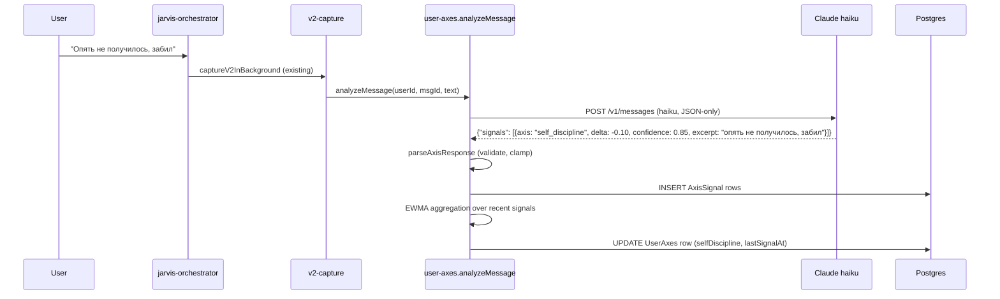

# v2.0 Phase B1 — USER NEST Axes (Content Adaptation through Personality Modeling)

> **Approved by Berik 2026-05-31.** First sub-project of Phase B. Quality
> bar = «Умный Джарвис» — глубокий, не халтурный, лучше медленно и
> правильно чем быстро и плохо (precedent 2026-05-31 discipline lock).
> Scope locked. Berik decisions noted inline.

---

## 0. Reading order

1. §1 Контекст — что и зачем
2. §2 Архитектура — high-level
3. §3 Axes definition — что мы реально измеряем
4. §4 Schema + API
5. §5 Update pipeline (Claude haiku)
6. §6 EWMA aggregation math
7. §7 Content adaptation (Layer 1 prompt + Layer 2 code rules)
8. §8 Telegram `/axes` transparency
9. §9 Bootstrap migration (UserProfile.patterns → axes)
10. §10 Failure modes
11. §11 Test strategy
12. §12 Rollout (feature flag)
13. §13 Self-review checklist
14. §14 Out of scope

---

## 1. Контекст и цели

### 1.1 Phase A leaves a gap

Phase A bot remembers facts + reacts to mood + uses 5-tier cognitive
memory. But two users with identical Memory rows получают идентичные
советы. Бот реагирует на **состояние** (mood snapshot), но не понимает
**личность** (устойчивые паттерны мышления и поведения).

Пример: Berik имеет low self-discipline (90 дней нулевого выполнения 4
запланированных привычек). Bot всё равно с радостью предлагает «давай
запишем 5 новых привычек на эту неделю». Это setting user up for
failure — bot не учится из истории неудач.

### 1.2 What B1 changes

B1 вводит **continuous personality axes** — численные оценки 4
устойчивых traits, накапливаемых из каждого user message. Bot
интерпретирует эти axes и **меняет КОНТЕНТ** своих советов (не tone, не
proactivity timing — это B2 и B5+).

### 1.3 Concrete behavior changes

Берик (self-discipline 0.25, emotional-openness 0.7):
- Юзер: «помоги выстроить ежедневные привычки»
- **Phase A bot:** «Хорошо! Запиши: вода 12:00, чтение 30 мин, 10к шагов,
  1ч учёбы. Каждый день, неделю.»
- **Phase B1 bot:** «Слушай, я помню что предыдущие 4 привычки за 90
  дней не пошли. Может попробуем по-другому: ОДНА привычка, одна
  неделя. Какая самая важная сейчас?»

Айдана (hypothetical: emotional-openness 0.85, conflict-tolerance 0.4):
- Юзер: «опять с мамой поссорилась»
- **Phase A bot:** «Понимаю что это сложно. Что произошло?»
- **Phase B1 bot:** «Хм, чувствую что зацепило. Я не буду спрашивать
  "что случилось" — ты сама скажешь когда готова. Просто рядом.»
  (Уважает её низкую conflict-tolerance — не давит probing questions.)

### 1.4 Non-goals (clear scope boundary)

B1 НЕ делает:
- BOT axes (warmth/directness/humor drift) — это **B2 Identity
  evolution**
- Feedback loop (бот учится из user reactions) — это **B3 Cross-
  session learning**
- Auto-tool-creation — это **B4 Hermes skills**
- Big Five (OCEAN) psychometric model — locked decision: LifeOS-custom
  4 axes
- ML inference (Decision Tree, embedding similarity, etc.) — locked:
  Claude haiku classifier
- Multi-language axes — Russian только (как остальной v2)

### 1.5 Benchmark for B1 done

- ✅ Berik в Telegram: бот предложил 1-step plan (не multi) когда Berik
  попросил «выстрой 5 привычек», и явно сослался на self-discipline
- ✅ Axes снимаются автоматически с каждого msg, written to AxisSignal
- ✅ `/axes` command показывает 4 axes с current values
- ✅ Bootstrap script один раз lifted Berik+Aydana from UserProfile
- ✅ All Claude calls best-effort (no throws on 429/network)
- ✅ Feature flag rollout: Berik first, Aydana при готовности
- ✅ 0 регрессий в существующих 1387 тестах

---

## 2. Архитектурный overview

```
┌──────────────────────────────────────────────────────────────┐
│  INBOUND user msg (Telegram)                                  │
│           ↓                                                   │
│  jarvis-orchestrator.handleMessage                            │
│           ↓                                                   │
│  captureV2InBackground (existing Phase A pipeline)            │
│           ↓                                                   │
│  ┌─────────────────────────────────────────────────────┐     │
│  │  Promise.allSettled([                               │     │
│  │    extractEntities + upsertEntity + linkEntities,   │     │
│  │    recordEvent,                                     │     │
│  │    analyzeMessage (mood),                           │     │
│  │    ★ userAxes.analyzeMessage (NEW for B1) ★         │     │
│  │  ])                                                 │     │
│  └─────────────────────────────────────────────────────┘     │
│           ↓                                                   │
│  AxisSignal rows written (1-4 per msg, append-only log)       │
│           ↓                                                   │
│  EWMA aggregation → UserAxes table updated                    │
└──────────────────────────────────────────────────────────────┘

┌──────────────────────────────────────────────────────────────┐
│  OUTBOUND bot reply generation                                │
│           ↓                                                   │
│  buildJarvisPrompt (system prompt)                            │
│           ↓                                                   │
│  ★ buildV2EnrichmentBlock + axes section ★ (NEW)              │
│           ↓                                                   │
│  Claude API → response                                        │
│           ↓                                                   │
│  ★ Post-process content rules ★ (NEW, 3 gates)                │
│    - gateGoalDecomposition                                    │
│    - gateEmotionalProbing                                     │
│    - gateChallenge                                            │
│           ↓                                                   │
│  Final reply to user                                          │
└──────────────────────────────────────────────────────────────┘
```

### 2.1 Components added in B1

| File | Lines (est) | Purpose |
|---|---|---|
| `prisma/schema.prisma` (edit) | +35 | UserAxes + AxisSignal models |
| `prisma/migrations/<timestamp>_v2_user_axes/migration.sql` | ~50 | Idempotent CREATE TABLE + indexes |
| `services/user-axes/types.ts` | ~50 | UserAxesStore interface, types |
| `services/user-axes/postgres-impl.ts` | ~280 | PostgresUserAxes class + EWMA helper |
| `services/user-axes/index.ts` | ~25 | Singleton accessor + `_resetForTests` |
| `services/user-axes/analyze-message.ts` | ~180 | Claude haiku call + parseAxisResponse |
| `services/user-axes/content-rules.ts` | ~200 | 3 hard gates + applyRules orchestrator |
| `services/v2-capture.ts` (edit) | +15 | Parallel branch for axes.analyzeMessage |
| `services/v2-enrichment.ts` (edit) | +60 | Axes block formatter in system prompt |
| `services/telegram-bot.ts` (edit) | +40 | `/axes` command handler |
| `services/jarvis-orchestrator.ts` (edit) | +30 | Post-process rules hook |
| `scripts/bootstrap-axes.ts` | ~150 | One-time UserProfile.patterns → UserAxes |
| `lib/feature-flags.ts` (edit) | +5 | `isV2AxesEnabled(userId)` |
| Tests across all of the above | ~900 | Mostly pure helpers + structural |

**Total estimate:** ~2000 lines of code + tests.

### 2.2 Singleton pattern

Mirrors Phase A: `services/user-axes/index.ts` exports
`getUserAxesStore()` (lazy singleton) + `_resetUserAxesForTests()`.

Pattern identical to `entity-graph/index.ts`, `procedural-memory.
singleton.ts`, etc.

---

## 3. Axes definition

Каждый axis = continuous Float in [0, 1], default 0.5 (neutral). Semantic
labels for LLM prompts:
- `[0.0, 0.3)` — low
- `[0.3, 0.7]` — moderate (default zone)
- `(0.7, 1.0]` — high

### 3.1 self-discipline (SD)

**Что измеряет:** вероятность что user follow-through on commitments.

**UP signals (positive delta):**
- explicit completion: «сделал», «выполнил», «закрыл», «дочитал», «дошёл до»
- habit log entry (system-side, see §5.2 for hybrid signal source)
- task completion within deadline
- mention of consistency: «уже неделю подряд», «третий день»

**DOWN signals (negative delta):**
- explicit failure: «не успел», «забыл», «не получилось», «провалил»
- repeated promise without follow-up: «обещаю» × 2 без выполнения
- task overdue past deadline (system-side detection)
- mention of inconsistency: «уже забил», «опять забил», «3-й раз
  переношу»

**Examples:**
- «Сделал утреннюю зарядку!» → SD +0.08, confidence 0.85
- «Опять не получилось, забил» → SD -0.10, confidence 0.85
- «Хочу учить английский» (intent, not result) → SD 0, confidence 0
  (no signal — это намерение, не выполнение)
- «Подскажи как лучше учить английский» → SD 0, confidence 0 (вопрос)

**High SD (0.8+) implication for bot:**
- Bot может предлагать многошаговые планы
- Bot может задавать ambitious targets («50 books a year — реально?»)
- Bot ожидает что user сделает что обещал

**Low SD (<0.3) implication for bot:**
- Bot НЕ предлагает multi-step plans
- Bot фокусируется на ОДНОМ next-action
- Bot реже использует «обещай», чаще «давай попробуем»
- Bot сам напоминает о консистентности, не ожидает

### 3.2 emotional-openness (EO)

**Что измеряет:** насколько readily user shares feelings.

**UP signals:**
- emotional vocab: «грустно», «переживаю», «злюсь», «чувствую», «больно»
- body sensations: «давит в груди», «не сплю», «не ем»
- self-disclosure: «мне страшно что», «я думаю что я» (vulnerability)
- explicit naming feeling: «это меня бесит», «я в восторге»

**DOWN signals:**
- factual-only language: только действия и факты, без internal state
- explicit deflection: «всё норм» при наличии context негатива
- topic-shift away from emotion: bot спросил чувства → user отвечает
  о делах
- brevity на emotional questions (1-3 слова)

**Examples:**
- «Грустно сегодня, давит в груди» → EO +0.12, confidence 0.9
- «Зашёл купить молоко» → EO 0, confidence 0 (factual, irrelevant)
- «Я в порядке» после контекста ссоры → EO -0.05, confidence 0.6
  (deflection)
- «Не знаю что чувствую, но хреново» → EO +0.08, confidence 0.7
  (paradoxically high — даже когда не может назвать, признаёт что есть)

**High EO (0.7+) implication:**
- Bot может спрашивать «что чувствуешь?» прямо
- Bot ссылается на прошлые эмоциональные состояния
- Bot может предлагать journaling, mood-tracking, emotional inventories

**Low EO (<0.3) implication:**
- Bot suppresses «что чувствуешь?» style probes
- Bot фокусируется на practical help (actions, plans)
- Если bot хочет понять эмоциональный context — спрашивает косвенно
  («как день прошёл?» вместо «как ты?»)

### 3.3 conflict-tolerance (CT)

**Что измеряет:** user's appetite for being challenged / пушбэка.

**UP signals:**
- explicit pushback: «я не согласен», «по-моему ты не прав», «нет, это
  не так»
- debating: extended back-and-forth с reasoning
- accepting hard feedback: bot сказал «вижу противоречие» → user не
  убежал
- requesting challenge: «скажи правду», «не щади», «как есть»

**DOWN signals:**
- avoidance: bot задал hard question → user shift topic
- defensive: «нет, ты не понимаешь», «это не то»
- abrupt change subject mid-disagreement
- bot expressed concern → user replied «всё ок, спасибо» (closing)

**Examples:**
- «Слушай, я не согласен — у меня были другие причины» → CT +0.08
- «А, забей, не важно» (после bot pushback) → CT -0.05
- «Прав ли я что забил на цели? Скажи как есть» → CT +0.10 (request)
- «Я знаю что прокрастинирую, не нужно напоминать» → CT -0.06

**High CT (0.7+) implication:**
- Bot может быть «strict trainer»: указывать противоречия, holding
  user accountable
- Bot может вернуться к старым broken commitments
- Bot может задавать uncomfortable questions

**Low CT (<0.3) implication:**
- Bot default supportive mode
- Критику только если user explicitly invited
- Если bot видит проблему — оформляет как curiosity question, не
  judgment

### 3.4 introspection-depth (ID)

**Что измеряет:** user's tendency for self-reflection / causal analysis.

**UP signals:**
- causal language: «почему я так делаю», «может это потому что»,
  «корень в»
- meta-cognition: «я заметил что я», «мне свойственно», «у меня
  паттерн»
- past-self comparison: «раньше я был другим», «я меняюсь»
- big-picture framing: «что для меня важно», «зачем мне это вообще»

**DOWN signals:**
- descriptive without analysis: «это случилось» без «почему»
- external attribution: «это потому что они», «обстоятельства»
- present-focus only: никаких references to patterns over time
- short answer на reflective questions

**Examples:**
- «Почему я снова откладываю? Может потому что страшно начать?» →
  ID +0.10
- «Это потому что Серик не позвонил» → ID -0.04 (external attribution)
- «Я заметил что у меня паттерн — каждый раз когда устаю, забиваю» →
  ID +0.12 (meta-cognition, strong signal)
- «Не пошло» (single-word без elaboration) → ID -0.03

**High ID (0.7+) implication:**
- Bot может задавать philosophical questions
- Bot может suggest journaling prompts
- Bot может delve into patterns («заметил что ты делаешь X в Y
  ситуациях»)

**Low ID (<0.3) implication:**
- Bot фокусируется на action steps, не на «почему»
- Bot не открывает philosophical loops
- Если что-то требует reflection — bot does it FOR user (suggests
  observation, не спрашивает open-ended «как ты думаешь?»)

### 3.5 Why 4 not more, not less

**Why not Big Five (OCEAN):**
- Openness — не actionable для LifeOS bot (это про любопытство к
  новому опыту в целом — слабо влияет на task/habit guidance)
- Conscientiousness — overlaps с self-discipline, но более abstract
- Extraversion — не observable из 1-on-1 chat
- Agreeableness — uninformative для bot-user interaction
- Neuroticism — overlaps с emotional-openness (но shadow-side)

LifeOS-custom 4 axes — каждая directly observable from chat AND
directly drives bot content choice. Большая практическая мощность с
меньшим surface area.

**Why not 5+:**
- task-breakdown-preference (likes 1-step vs big plans) — производная
  от self-discipline
- social-orientation (prefers solo work vs collab) — не observable из
  1-on-1 чата с ботом
- future-orientation — overlap с introspection-depth

Risk add'l axes: noise, harder to validate, marginal lift. 4 sweet spot.

---

## 4. Schema + API

### 4.1 Prisma models

```prisma
// NEW table — current axis values (1 row per user)
model UserAxes {
  id                  String   @id @default(cuid())
  userId              String   @unique
  user                User     @relation(fields: [userId], references: [id], onDelete: Cascade)

  // 4 axes, all Float in [0, 1], default 0.5 (neutral)
  selfDiscipline      Float    @default(0.5)
  emotionalOpenness   Float    @default(0.5)
  conflictTolerance   Float    @default(0.5)
  introspectionDepth  Float    @default(0.5)

  // Provenance — useful for transparency and debugging
  signalCount         Int      @default(0)   // total AxisSignal contributing
  lastSignalAt        DateTime?              // when last signal arrived
  createdAt           DateTime @default(now())
  updatedAt           DateTime @updatedAt

  @@index([userId])
}

// NEW table — append-only log of individual signals, used for EWMA
// aggregation, recomputation, and /axes transparency
model AxisSignal {
  id           String   @id @default(cuid())
  userId       String
  user         User     @relation(fields: [userId], references: [id], onDelete: Cascade)
  // Source ChatMessage. Nullable for bootstrap signals.
  msgId        String?
  // 'self_discipline' | 'emotional_openness' | 'conflict_tolerance' |
  // 'introspection_depth'
  axis         String
  // Per-signal delta in [-1.0, +1.0]. Will be clamped on insert.
  delta        Float
  // Claude's confidence in [0.0, 1.0]. delta is weighted by confidence
  // during aggregation.
  confidence   Float    @default(0.5)
  // Short excerpt of source content (max 200 chars) for /axes & audit.
  excerpt      String?
  // 'claude_classifier' | 'system_signal' | 'bootstrap' | 'manual'
  source       String   @default("claude_classifier")
  recordedAt   DateTime @default(now())

  @@index([userId, axis, recordedAt])
  @@index([userId, recordedAt])
  @@index([msgId])
}
```

### 4.2 Why 2 tables not 1

`UserAxes` is the **current state** (single row, fast read for prompt
enrichment).

`AxisSignal` is the **append-only log** — needed for:
- Recomputation if EWMA params change (don't lose history)
- Transparency in `/axes` (show recent signals)
- Debugging when axes feel wrong
- Future B3 cross-session learning (signal patterns)

Trade-off: 2 tables вместо 1. Storage ~30-50 signals/day/user. 1 year
~10K rows per user — easily handled by Postgres.

### 4.3 API surface

```typescript
// packages/server/src/services/user-axes/types.ts

export type AxisName =
  | 'self_discipline'
  | 'emotional_openness'
  | 'conflict_tolerance'
  | 'introspection_depth';

export interface UserAxesValues {
  selfDiscipline: number;
  emotionalOpenness: number;
  conflictTolerance: number;
  introspectionDepth: number;
  signalCount: number;
  lastSignalAt: Date | null;
}

export interface AxisSignalInput {
  axis: AxisName;
  delta: number;       // -1..+1 (clamped)
  confidence: number;  // 0..1 (clamped)
  excerpt?: string;
}

export interface UserAxesStore {
  // Read current axis values for prompt enrichment / content rules
  getAxes(userId: string): Promise<UserAxesValues>;

  // Write signals + recompute axes via EWMA
  // Best-effort: never throws. Signals are applied; aggregation logged on error.
  recordSignals(
    userId: string,
    msgId: string | null,
    signals: AxisSignalInput[],
    source?: 'claude_classifier' | 'system_signal' | 'bootstrap' | 'manual',
  ): Promise<{ written: number; skipped: number }>;

  // For /axes transparency — last N signals per axis
  recentSignals(
    userId: string,
    axis: AxisName,
    limit?: number,
  ): Promise<Array<{
    delta: number;
    confidence: number;
    excerpt: string | null;
    recordedAt: Date;
  }>>;

  // For debugging — recompute axes from full signal history.
  // (Used in tests + ad-hoc data fix; not in hot path.)
  recomputeFromSignals(userId: string): Promise<UserAxesValues>;
}
```

### 4.4 Migration SQL (idempotent)

`prisma/migrations/<timestamp>_v2_user_axes/migration.sql`:

```sql
-- UserAxes table
CREATE TABLE IF NOT EXISTS "UserAxes" (
  "id"                  TEXT PRIMARY KEY,
  "userId"              TEXT NOT NULL UNIQUE,
  "selfDiscipline"      DOUBLE PRECISION NOT NULL DEFAULT 0.5,
  "emotionalOpenness"   DOUBLE PRECISION NOT NULL DEFAULT 0.5,
  "conflictTolerance"   DOUBLE PRECISION NOT NULL DEFAULT 0.5,
  "introspectionDepth"  DOUBLE PRECISION NOT NULL DEFAULT 0.5,
  "signalCount"         INTEGER NOT NULL DEFAULT 0,
  "lastSignalAt"        TIMESTAMP(3),
  "createdAt"           TIMESTAMP(3) NOT NULL DEFAULT CURRENT_TIMESTAMP,
  "updatedAt"           TIMESTAMP(3) NOT NULL,
  CONSTRAINT "UserAxes_userId_fkey"
    FOREIGN KEY ("userId") REFERENCES "User"("id") ON DELETE CASCADE
);
CREATE INDEX IF NOT EXISTS "UserAxes_userId_idx" ON "UserAxes"("userId");

-- AxisSignal append-only log
CREATE TABLE IF NOT EXISTS "AxisSignal" (
  "id"           TEXT PRIMARY KEY,
  "userId"       TEXT NOT NULL,
  "msgId"        TEXT,
  "axis"         TEXT NOT NULL,
  "delta"        DOUBLE PRECISION NOT NULL,
  "confidence"   DOUBLE PRECISION NOT NULL DEFAULT 0.5,
  "excerpt"      TEXT,
  "source"       TEXT NOT NULL DEFAULT 'claude_classifier',
  "recordedAt"   TIMESTAMP(3) NOT NULL DEFAULT CURRENT_TIMESTAMP,
  CONSTRAINT "AxisSignal_userId_fkey"
    FOREIGN KEY ("userId") REFERENCES "User"("id") ON DELETE CASCADE
);
CREATE INDEX IF NOT EXISTS "AxisSignal_userId_axis_recordedAt_idx"
  ON "AxisSignal"("userId", "axis", "recordedAt");
CREATE INDEX IF NOT EXISTS "AxisSignal_userId_recordedAt_idx"
  ON "AxisSignal"("userId", "recordedAt");
CREATE INDEX IF NOT EXISTS "AxisSignal_msgId_idx"
  ON "AxisSignal"("msgId");
```

All idempotent. Safe to re-apply via `prisma db execute --file`.

---

## 5. Update pipeline

### 5.1 Inbound flow



### 5.2 Hybrid signal sources

Помимо Claude classifier per-message, B1 также пишет **system signals**
из существующих data sources:

| Source | Axis | Frequency | Notes |
|---|---|---|---|
| Habit log completion | self_discipline +0.05 | per completion | Bot reads HabitLog table |
| Task overdue | self_discipline -0.04 | nightly cron | Tasks past `date` без `completed=true` |
| Mood snapshot extreme | emotional_openness +0.03 if abs(valence)>0.5 | per analyze | High emotional content = openness signal |
| Long emotional message (>50 chars + emotion vocab) | emotional_openness +0.04 | per analyze | Length + vocab heuristic |

Эти hybrid signals enter same AxisSignal log with `source='system_signal'`
для transparency.

**Phase B1 includes only Claude classifier + 1 system signal**
(`mood_snapshot_extreme`). Полный hybrid набор → Phase B follow-up
(B1.5). Keeps scope tight.

### 5.3 Claude haiku prompt (SYSTEM)

```
Ты — анализатор личности LifeOS. Из одного сообщения пользователя извлеки
сигналы по 4 осям личности.

ОСИ:
- self_discipline (0..1): склонность follow-through на обещания. UP:
  явные «сделал», «выполнил», «дочитал», consistency mentions. DOWN:
  «забыл», «не успел», «опять не получилось», repeated promises без
  follow-up.
- emotional_openness (0..1): готовность делиться чувствами. UP: emotional
  vocab («грустно», «злюсь», «переживаю»), body sensations, self-
  disclosure. DOWN: factual-only, «всё норм» при context негатива,
  deflection.
- conflict_tolerance (0..1): аппетит к pushback. UP: «не согласен»,
  debating, «скажи как есть». DOWN: avoidance, defensive, abrupt
  topic-shift при challenge.
- introspection_depth (0..1): self-reflection. UP: «почему я», causal
  language, meta-cognition, past-self comparison. DOWN: descriptive без
  analysis, external attribution, present-focus only.

ПРАВИЛА:
1. Верни ТОЛЬКО валидный JSON. Без markdown.
2. Для КАЖДОЙ оси где есть evidence — return signal. Иначе omit.
3. delta range [-1.0, +1.0]. Strong signals (e.g. clear failure) ~0.10,
   medium ~0.05, weak ~0.02.
4. confidence [0, 1]. Высокая если signal явный и unambiguous.
5. excerpt — short fragment up to 100 chars показывающий signal.

ФОРМАТ:
{
  "signals": [
    {"axis": "self_discipline", "delta": -0.10, "confidence": 0.85, "excerpt": "опять не получилось"},
    ...
  ]
}

Если signals нет — верни {"signals": []}.

НЕ добавляй объяснений, только JSON.
```

### 5.4 Best-effort error handling

```typescript
export async function analyzeMessage(
  userId: string,
  msgId: string,
  text: string,
): Promise<void> {
  try {
    const response = await anthropic.messages.create({
      model: MODELS.haiku,
      max_tokens: 512,
      system: AXIS_SYSTEM_PROMPT,
      messages: [{ role: 'user', content: text }],
    });

    const content = response.content[0];
    if (!content || content.type !== 'text') return;

    const parsed = parseAxisResponse(content.text);
    if (parsed.signals.length === 0) return;

    await getUserAxesStore().recordSignals(
      userId,
      msgId,
      parsed.signals,
      'claude_classifier',
    );
  } catch (err) {
    console.warn('[user-axes] analyzeMessage failed:', err);
    // NEVER throw — user reply must not be blocked.
  }
}
```

### 5.5 Pure helper: parseAxisResponse

Exported for unit testing. Handles markdown fences, missing keys,
non-array signals, invalid axis names, out-of-range deltas — all
gracefully.

```typescript
export function parseAxisResponse(raw: string): { signals: AxisSignalInput[] } {
  const empty = { signals: [] as AxisSignalInput[] };
  if (!raw || !raw.trim()) return empty;

  let text = raw.trim();
  if (text.startsWith('```')) {
    text = text.replace(/^```(?:json)?\s*/, '').replace(/```\s*$/, '').trim();
  }

  try {
    const parsed = JSON.parse(text);
    const signals = Array.isArray(parsed.signals) ? parsed.signals : [];
    const VALID_AXES: AxisName[] = [
      'self_discipline', 'emotional_openness',
      'conflict_tolerance', 'introspection_depth',
    ];
    return {
      signals: signals
        .filter((s: any) => s && typeof s === 'object')
        .filter((s: any) => VALID_AXES.includes(s.axis))
        .map((s: any) => ({
          axis: s.axis as AxisName,
          delta: clampDelta(Number(s.delta)),
          confidence: clampConfidence(Number(s.confidence)),
          excerpt: typeof s.excerpt === 'string'
            ? s.excerpt.slice(0, 200) : undefined,
        }))
        .filter((s: AxisSignalInput) => s.confidence > 0),
    };
  } catch {
    return empty;
  }
}

export function clampDelta(d: number): number {
  if (Number.isNaN(d)) return 0;
  return Math.max(-1, Math.min(1, d));
}

export function clampConfidence(c: number): number {
  if (Number.isNaN(c)) return 0;
  return Math.max(0, Math.min(1, c));
}
```

---

## 6. EWMA aggregation math

### 6.1 Why EWMA, not naive sum

**Naive sum** `axis = axis + delta × confidence` — unbounded,
domain-violation. Plus single bad signal moves axis permanently.

**Naive average** `axis = sum(deltas × confidence) / N` — outliers
dominate early, then dampen as N grows. Not adaptive to **shifts** in
behavior over time (если user changed, average doesn't catch up).

**EWMA** (Exponentially Weighted Moving Average) — recent signals
weighted higher, but old ones don't disappear. Perfect for axes that
should be **adaptive but stable**.

### 6.2 Formula

For each incoming signal `(delta, confidence)`:

```
weighted_delta = delta × confidence
axis_target = clamp01(axis_current + weighted_delta)
axis_new = α × axis_target + (1 - α) × axis_current
```

Where:
- `α = 0.05` (smoothing factor — locked decision)
- `clamp01(x) = max(0, min(1, x))`

### 6.3 Calibration

α = 0.05 means: чтобы axis сдвинулся на 50% от current к target, нужно
~14 signals в одну сторону (ln(0.5) / ln(0.95) ≈ 13.5).

Real-world example for Berik:
- Start: selfDiscipline = 0.5
- 10 messages over a week: all DOWN signals avg delta=-0.08,
  confidence=0.85
- weighted_delta avg = -0.068
- After 10 EWMA steps: axis ≈ 0.5 + α × Σ … ≈ **0.47**
- Slow but consistent. After 30 such signals: ≈ 0.36.
- After 100: ≈ 0.20.

Это значит **bot не yo-yo'ит** на одном плохом дне. Real personality
change occurs over weeks. Cumulative truth wins.

### 6.4 Pure helper

```typescript
export function applyEwma(
  current: number,
  delta: number,
  confidence: number,
  alpha: number = 0.05,
): number {
  const weighted = delta * confidence;
  const target = Math.max(0, Math.min(1, current + weighted));
  return alpha * target + (1 - alpha) * current;
}
```

Unit-testable, deterministic, no I/O.

---

## 7. Content adaptation hook

### 7.1 Two-layer design

**Layer 1: System prompt enrichment** — broad LLM judgment
**Layer 2: Code rules** — safety-critical post-process gates

Layer 1 is *suggested* behavior change. Layer 2 is *enforced*.

### 7.2 Layer 1 — prompt extension

`buildV2EnrichmentBlock` (existing from Phase A) gets new section after
top entities:

```
## Личностные оси (continuous 0..1, обновляются с каждым сообщением)

- self-discipline: 0.25 — низкая. Юзер борется с follow-through на
  обещания. НЕ предлагай multi-step plans или несколько новых привычек
  одновременно. Помогай через «следующий ОДИН маленький шаг». Если
  юзер просит большой план — мягко предложи начать с одного.

- emotional-openness: 0.72 — высокая. Юзер открыт обсуждать чувства.
  Можешь спрашивать «что чувствуешь?», ссылаться на прошлые
  эмоциональные состояния, suggest journaling/mood reflection.

- conflict-tolerance: 0.35 — умеренно-низкая. Юзер защитен при пушбэке.
  Default — supportive mode. Критику ставь только если юзер явно
  попросил («скажи как есть»). Если видишь противоречие — спроси «как
  ты сам это видишь?» вместо «ты не прав».

- introspection-depth: 0.58 — средняя. Юзер reflectes но не сильно
  philosophy. Можешь спрашивать «почему» если на context, но не уходи
  в abstract loops. Конкретика > absractика.
```

Generated dynamically per user, per request, from `getAxes(userId)`.

### 7.3 Tone semantics for axes labels

Pure helper `axisLabel(value)`:
- `< 0.2` → «очень низкая»
- `[0.2, 0.4)` → «низкая»
- `[0.4, 0.6]` → «средняя»
- `(0.6, 0.8]` → «высокая»
- `> 0.8` → «очень высокая»

Used in both prompt block AND `/axes` Telegram output.

### 7.4 Layer 2 — code rules (3 hard gates)

File `services/user-axes/content-rules.ts`. Each gate is a pure function
+ async wrapper that reads UserAxes.

**Gate 1: gateGoalDecomposition**

```typescript
export function shouldForceOneStep(
  axes: UserAxesValues,
  proposedStepCount: number,
): { force: boolean; reason?: string } {
  if (axes.selfDiscipline < 0.3 && proposedStepCount > 1) {
    return {
      force: true,
      reason: `selfDiscipline=${axes.selfDiscipline.toFixed(2)} — refuse multi-step plan`,
    };
  }
  return { force: false };
}
```

Hook point: `jarvis-orchestrator` post-process. After Claude generated
response, run `extractStepCount(reply)` heuristic (regex for «1.» «2.»
«3.» bullets or «во-первых», «во-вторых»). If `shouldForceOneStep`
fires, ask Claude to re-generate with «давай начнём с одного шага»
prefix.

Implementation note: re-generation adds latency. Only fire when
`stepCount >= 3` (threshold tuneable).

Logged to Insights stream: `{kind: 'axis_rule_fired', rule: 'goal_decomposition', userId, axisValue: 0.25, stepCount: 5}`.

**Gate 2: gateEmotionalProbing**

```typescript
export function shouldSuppressEmotionalProbing(
  axes: UserAxesValues,
  recentUserMsgsCount: number,
  emotionalContentRecent: boolean,
): boolean {
  if (axes.emotionalOpenness >= 0.3) return false;
  if (emotionalContentRecent) return false; // user opened door first
  return recentUserMsgsCount >= 3; // only after some history
}
```

Hook point: pre-process. Before bot's Claude call, if this gate fires,
add to system prompt: «НЕ задавай вопрос про чувства/эмоции в этом
ответе. Юзер не готов».

**Gate 3: gateChallenge**

```typescript
export function shouldSoftenChallenge(
  axes: UserAxesValues,
  draftReply: string,
): { soften: boolean; suggestedReframe?: string } {
  if (axes.conflictTolerance >= 0.3) return { soften: false };
  // Look for assertive challenge language in draft reply.
  const assertivePatterns = [
    /\bты не прав\b/i, /\bэто неправильно\b/i, /\bты противоречишь\b/i,
    /\bперестань\b/i, /\bхватит\b/i,
  ];
  for (const pat of assertivePatterns) {
    if (pat.test(draftReply)) {
      return {
        soften: true,
        suggestedReframe: 'Replace assertion with curious question. ' +
          'Instead of "ты не прав" → "как ты сам это видишь?"',
      };
    }
  }
  return { soften: false };
}
```

Hook point: post-process. If gate fires, ask Claude to re-generate with
softening instruction in prompt.

### 7.5 Rule firing visibility

Every rule fire → Insight row written:
```typescript
prisma.insight.create({
  data: {
    userId,
    source: 'axis_rule',
    kind: 'goal_decomposition_forced', // or _suppression / _softened
    payload: { axisValue, draftSnippet, ruleReason },
    deliveredAt: null,
  },
});
```

Not delivered to user (internal log). Berik queries для debugging.

### 7.6 Why hybrid not just prompt

Pure prompt (Layer 1 only) — Claude often **ignores** soft instructions
under conversational pressure. Example: user requests «давай выстроим
5 привычек». Even with prompt saying «не предлагай multi-step», LLM
defaults to помогает с тем что попросили.

Hard rules (Layer 2) catch this — regenerate with constraint when
contract violated. Reliable.

Pure rules (Layer 2 only) — rigid, can't handle nuance. Если user
себя hard-pushed на multi-step и понимает risk — rigid rule mishandles.

Hybrid = LLM judgment for nuance + hard catch for safety-critical
failure modes.

---

## 8. `/axes` Telegram command (transparency)

### 8.1 UX

User sends `/axes` → bot replies:

```
Твои личностные оси (continuous 0..1):

🎯 self-discipline: 0.25 (низкая, было 0.42 месяц назад)
   Свежие сигналы:
   • -0.10 «опять не получилось забил» (вчера)
   • +0.04 «сделал зарядку» (3 дня назад)
   • -0.08 «не успел отчёт» (5 дней назад)

💖 emotional-openness: 0.72 (высокая, стабильна)
   Свежие сигналы:
   • +0.12 «грустно сегодня давит в груди» (вчера)
   • +0.06 «переживаю за маму» (2 дня назад)

🥊 conflict-tolerance: 0.35 (умеренно-низкая)
   Свежие сигналы:
   • -0.05 «а забей не важно» (вчера, после моего pushback)

🔍 introspection-depth: 0.58 (средняя)
   Свежие сигналы:
   • +0.10 «почему я снова откладываю» (3 дня назад)

Что значат axes: github.com/.../docs/AXES.md
```

### 8.2 Why expose

- **Validation:** Berik видит когда bot wrong → can correct via «эти
  axes неправильно описывают меня»
- **Trust:** transparency builds trust в LLM judgment
- **Debugging:** easy way to inspect during dev

### 8.3 Command handler

```typescript
bot.command('axes', async (ctx) => {
  if (!ctx.message) return;
  try {
    const user = await findOrCreateUser(ctx);
    const axes = await getUserAxesStore().getAxes(user.id);
    const text = await formatAxesForTelegram(user.id, axes);
    await ctx.reply(text);
  } catch (err) {
    console.warn('[telegram:axes] failed:', err);
    await ctx.reply('Не получилось получить axes. Попробуй позже.');
  }
});

async function formatAxesForTelegram(
  userId: string, axes: UserAxesValues,
): Promise<string> {
  const labels: Array<[string, AxisName, number, string]> = [
    ['🎯', 'self_discipline', axes.selfDiscipline, 'self-discipline'],
    ['💖', 'emotional_openness', axes.emotionalOpenness, 'emotional-openness'],
    ['🥊', 'conflict_tolerance', axes.conflictTolerance, 'conflict-tolerance'],
    ['🔍', 'introspection_depth', axes.introspectionDepth, 'introspection-depth'],
  ];
  const lines: string[] = ['Твои личностные оси (continuous 0..1):', ''];
  for (const [emoji, axisName, value, displayName] of labels) {
    lines.push(`${emoji} ${displayName}: ${value.toFixed(2)} (${axisLabel(value)})`);
    const recent = await getUserAxesStore().recentSignals(userId, axisName, 3);
    if (recent.length > 0) {
      lines.push('   Свежие сигналы:');
      for (const s of recent) {
        const sign = s.delta >= 0 ? '+' : '';
        const when = relativeDate(s.recordedAt);
        const exc = s.excerpt ? ` «${s.excerpt.slice(0, 50)}»` : '';
        lines.push(`   • ${sign}${s.delta.toFixed(2)}${exc} (${when})`);
      }
    }
    lines.push('');
  }
  return lines.join('\n').trim();
}
```

---

## 9. Bootstrap migration

### 9.1 Why bootstrap

Berik имеет богатый `UserProfile.patterns` (from Phase 6 life-truth-
analyzer) — phrases like:
- «ставит амбициозные цели, выполнение нулевое за 90 дней» → SD low
- «много задач висит невыполненными, задаёт один вопрос несколько раз
  — возможно тревога/прокрастинация» → SD low, EO moderate
- «реагирует на практические советы, а не на мотивационные речи» → ID
  low-medium
- «реагирует остро, до слёз — конфликты с близкими» → CT low

Если стартовать с 0.5 на все axes — bot будет совершать ошибки на
старте, пока не наберётся 14+ signals. Bootstrap = use existing
psycho-profile для starting values.

### 9.2 Bootstrap algorithm

Script `packages/server/scripts/bootstrap-axes.ts`:

```
For each --user=<id>:
  1. Read UserProfile (patterns + triggers + styleNotes)
  2. Compose Claude haiku prompt: "Given this psycho-profile, output
     initial values for 4 axes (0..1). Justify each."
  3. Parse response → AxisSignalInput[] with source='bootstrap'
  4. Apply via recordSignals — but use bigger weight (alpha=0.30 for
     bootstrap only, или write directly to UserAxes overriding 0.5)
  5. Log all bootstrap signals в AxisSignal с source='bootstrap'
  6. Print report
```

CLI: `npx tsx scripts/bootstrap-axes.ts --user=<id> --dry-run | --apply`

Same shape as `migrate-to-v2.ts` and `dedup-entities.ts`.

### 9.3 Bootstrap claude prompt

```
Дан psycho-profile пользователя (накоплен из long-term observation).
Оцени 4 личностные оси для starting calibration новой системы.

PROFILE:
{userProfile.patterns}
{userProfile.triggers}
{userProfile.styleNotes}

Верни JSON: 4 axes, каждая в [0, 1], plus justification.

{
  "axes": [
    {"axis": "self_discipline", "value": 0.25, "justification": "..."},
    ...
  ]
}
```

### 9.4 Idempotency

Re-running bootstrap should be safe. Strategy:
- Check if UserAxes row exists AND signalCount > 0 AND non-bootstrap
  signals exist → skip (don't override real user signals with
  bootstrapped estimates)
- Else: write bootstrap signals + reset UserAxes with appropriate
  initial values

---

## 10. Failure modes

| # | Mode | Detection | Mitigation |
|---|---|---|---|
| 1 | Claude returns invalid JSON | `parseAxisResponse` try/catch | Skip msg, log warning. Next msg tries again. |
| 2 | Claude rate-limited (429) | HTTP error | Best-effort skip. User msg unaffected. Anthropic rate-limits unlikely in steady state. |
| 3 | Network failure to Claude | Promise reject | Same — skip + log. |
| 4 | `recordSignals` DB failure | Prisma error caught | Log + skip. Aggregation eventually reconciles via `recomputeFromSignals` on next msg or weekly cron. |
| 5 | Axis drift to 0 или 1 unrealistic | EWMA bounded by `clamp01` per step | Math: even with α=0.05 и max delta=1 confidence=1, single step drifts by ≤ 0.05 toward target. Cannot reach 0 or 1 in finite signals (asymptotic). |
| 6 | Bootstrap overrides real signals | Check signalCount + source filter | Bootstrap skipped if real signals exist. |
| 7 | AxisSignal table grows unbounded | Daily/weekly cron drop >180d | Phase B follow-up (analog to mood-retention from Week 6). |
| 8 | Rule fires spuriously | Insights log inspectable | Berik can tune thresholds via constants in `content-rules.ts`. |
| 9 | Claude shifts behaviour over time (model update) | Periodic re-validation via /axes | Manual recalibration with bootstrap + new prompt. |
| 10 | User feels misjudged | `/axes` shows reasoning; user can «не согласен с эмоциональностью 0.3» | Phase B3 cross-session learning will incorporate feedback. For B1, manual signal correction via `manual` source. |
| 11 | Feature flag flipping mid-session | `isV2AxesEnabled` check at each entry point | If off, axes ignored entirely. Bot back to Phase A behavior. |
| 12 | Two simultaneous msgs race on UserAxes update | Postgres MVCC + last-writer-wins | Acceptable — both signals written to AxisSignal log, EWMA self-corrects. Worst case: 1 step lost in aggregation, signal preserved. |

---

## 11. Test strategy

### 11.1 Pure unit tests (90%+ coverage)

`services/user-axes/__tests__/`:
- `clampDelta` — boundary, NaN, normal values
- `clampConfidence` — same
- `parseAxisResponse` — markdown fences, missing keys, invalid axes,
  out-of-range, empty signals
- `applyEwma` — convergence, monotonic, fixed-point at boundary
- `axisLabel` — boundary values
- `shouldForceOneStep` — at threshold, above, below
- `shouldSuppressEmotionalProbing` — combinatorial truth table
- `shouldSoftenChallenge` — regex matches/misses

### 11.2 Structural tests (readFileSync + grep)

Following Phase A pattern:
- `analyzeMessage` calls anthropic.messages.create with MODELS.haiku
- `parseAxisResponse` invoked
- `recordSignals` called with extracted signals
- Best-effort try/catch around entire body
- Singleton accessor + `_resetForTests`

### 11.3 Integration smoke

`__integration__/v2-axes-flow.test.ts`:
- Structural: orchestrator → captureV2 → userAxes.analyzeMessage chain
- Structural: enrichment block includes axes section
- Structural: post-process rules invoked

### 11.4 Behavioral SMOKE (Berik via Telegram, Phase B end)

After deploy:
1. Send 5 messages with explicit failure («забил», «не успел») →
   verify SD drops from 0.5 to ~0.42-0.45
2. Send `/axes` → verify display + recent signals
3. Send «давай выстроим 5 новых привычек на неделю» → expect bot to
   propose 1 (gate fired) + verify Insight row `axis_rule_fired`
4. Send «не нужно меня жалеть, говори как есть» → CT rises → next time
   bot uses more direct language

### 11.5 Test count target

- ~80 unit tests for pure helpers
- ~25 structural tests
- ~10 integration tests
- **Total: ~115 new tests** (continues +100/week trend from Phase A)

---

## 12. Rollout (feature flag)

### 12.1 Stages

```
Stage 1 (deploy):
  - Code merged, migration applied, but FEATURE_V2_AXES=none (default)
  - Zero behavioral change in prod

Stage 2 (Berik smoke, ~24h):
  - FEATURE_V2_AXES=user-{berikId}
  - Bootstrap script applied for Berik
  - Berik tests via /axes + sends test msgs

Stage 3 (Aydana, ~3-7 days):
  - FEATURE_V2_AXES=user-{berikId},user-{aydanaId}
  - Bootstrap for Aydana (if her UserProfile exists, else default 0.5)

Stage 4 (all users):
  - FEATURE_V2_AXES=all (or omit per-user list)
  - No new users start with bootstrap — they accumulate from scratch
```

### 12.2 Flag implementation

```typescript
// lib/feature-flags.ts (extend existing)
export function isV2AxesEnabled(userId: string): boolean {
  const flag = process.env.FEATURE_V2_AXES?.trim() ?? '';
  if (!flag || flag === 'none' || flag === 'false') return false;
  if (flag === 'all' || flag === 'true') return true;
  return flag.split(',').some((s) => s.trim() === `user-${userId}`);
}
```

### 12.3 Rollback

```bash
# Railway dashboard:
FEATURE_V2_AXES=none

# Or remove the env var entirely.
# Restart auto-deploys, behavior byte-identical to pre-B1.
# Data preserved (UserAxes / AxisSignal tables untouched).
```

---

## 13. Self-review checklist

### Placeholder scan
- [ ] No «TBD», «TODO», «implement appropriate» in production-relevant
  sections
- [ ] All API signatures complete (no `...` placeholders)
- [ ] Prisma schema fields all defined
- [ ] Bootstrap algorithm fully specified

### Internal consistency
- [ ] Every API method referenced in pipeline diagram is defined in §4.3
- [ ] All 4 axes definitions (§3) consistent with prompt (§5.3)
- [ ] Gate firing thresholds (§7.4) consistent with axis label cutoffs (§7.3)
- [ ] Failure modes (§10) cover all I/O boundaries in pipeline (§5)

### Ambiguity check
- [ ] EWMA α value specified (0.05)
- [ ] Bootstrap α override specified (0.30)
- [ ] Gate 1 step-count threshold specified (≥3 triggers)
- [ ] Rate limit on Anthropic — what happens (best-effort skip)
- [ ] What `source` enum values are allowed
- [ ] Axes default value (0.5)

### Scope check
- [ ] BOT axes NOT in B1 — deferred to B2
- [ ] Cross-session learning NOT in B1 — B3
- [ ] Auto-tools NOT in B1 — B4
- [ ] Multi-language not supported (Russian only)
- [ ] No ML, only Claude classifier + EWMA

### Edge cases
- [ ] First message (signalCount=0) — UserAxes row auto-created
- [ ] Empty/non-text Claude response — parseAxisResponse returns empty
- [ ] All-zero confidence signals — filtered out (not stored)
- [ ] User deletes account — cascade via FK ON DELETE CASCADE

### Test coverage
- [ ] Each pure helper has unit tests
- [ ] Integration smoke covers all 3 gates
- [ ] Behavioral SMOKE covers Berik-specific scenarios

---

## 14. Open questions

**None.** All decisions locked per «выбери сам, не спрашивай»
directive (precedent 2026-05-31). Berik approved scope outline before
spec writing. Spec is complete and self-contained.

---

## 15. Status

- ✅ Brainstorm complete (Berik approved 2026-05-31)
- ✅ Design spec written
- ⏳ Spec self-review (next step)
- ⏳ Berik reviews written spec
- ⏳ Implementation plan via `writing-plans` skill
- ⏳ Execution via `subagent-driven-development`

---

## Discipline reminder

Pacta sunt servanda. If during implementation возникает «давай ещё
это» → СТОП → спросить Berik (precedent 2026-05-28 L99) → дождаться →
обновить spec + memory.

«Выбери сам» (precedent 2026-05-31) применяется к тактическим
архитектурным решениям inside locked scope. НЕ к scope expansion.

Quality bar: «Умный Джарвис». Лучше медленно и качественно, чем быстро
и плохо.
